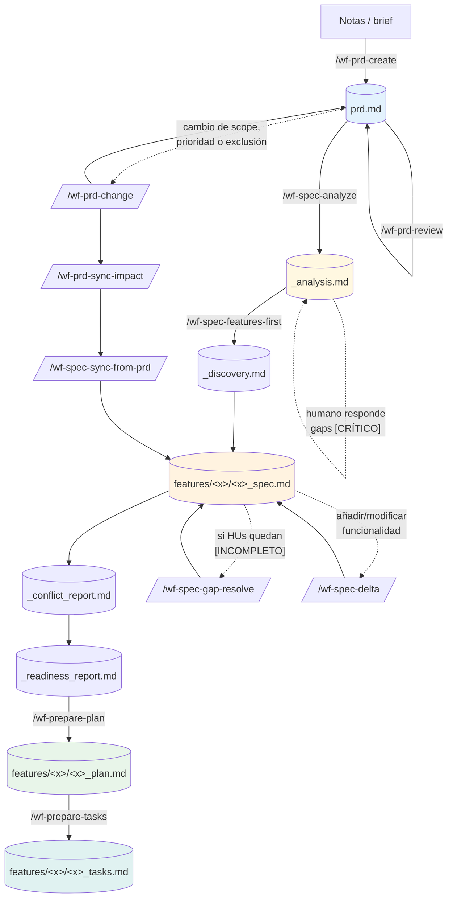
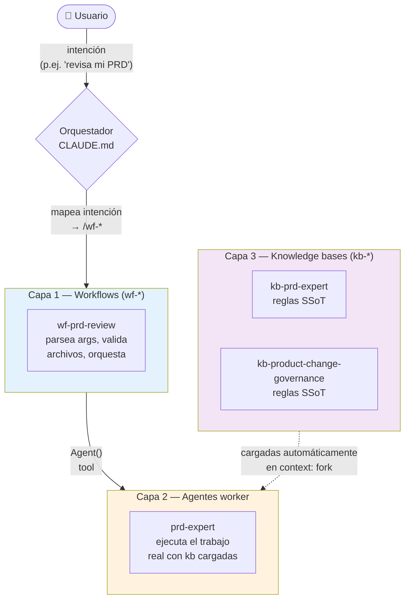
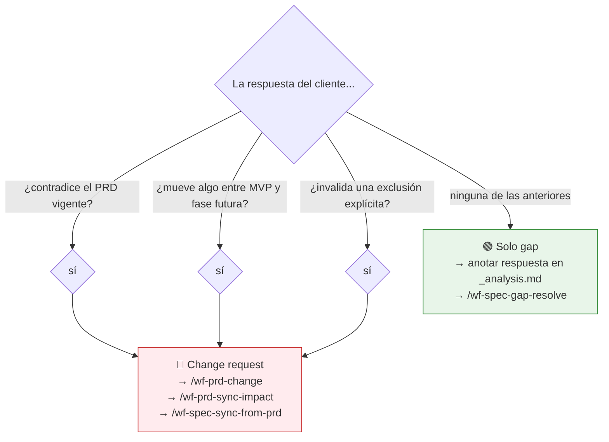

# SDD — Diagramas del pipeline

Vistas Mermaid del ecosistema SDD para entender la frontera PRD ↔ Spec ↔ Plan y el flujo de workflows. Útil para explicar el sistema a alguien nuevo o para refrescar memoria sobre qué comando ejecutar.

Los diagramas están pensados para leerse de forma independiente: cada uno responde **una sola pregunta**. Si vas a presentarlos en una sesión, el orden recomendado está al final.

---

## 1. Frontera PRD vs Spec vs Plan — qué responde cada artefacto

**Pregunta que responde:** ¿dónde acaba el PRD y dónde empieza el Spec?

```mermaid
flowchart LR
    subgraph PRD["📄 PRD — Negocio"]
        direction TB
        P1["¿Qué problema resuelve?"]
        P2["¿Quién lo usa? (actores)"]
        P3["¿Qué puede hacer cada actor? (capacidades)"]
        P4["¿Qué queda FUERA?"]
        P5["Reglas de negocio transversales"]
    end

    subgraph SPEC["📋 Spec — Funcional"]
        direction TB
        S1["Historias de usuario (HU)"]
        S2["Journeys paso a paso"]
        S3["Criterios de aceptación (GIVEN/WHEN/THEN)"]
        S4["Destinos de navegación"]
        S5["Edge cases y estados de error"]
    end

    subgraph PLAN["⚙️ Plan — Técnico"]
        direction TB
        T1["Stack, frameworks, APIs"]
        T2["Arquitectura, módulos, patrones"]
        T3["Modelos de datos"]
    end

    PRD ==>|wf-spec-analyze<br/>+ wf-spec-discover| SPEC
    SPEC ==>|wf-prepare-plan| PLAN

    style PRD fill:#e3f2fd,stroke:#1976d2
    style SPEC fill:#fff3e0,stroke:#f57c00
    style PLAN fill:#e8f5e9,stroke:#388e3c
```

**Mensaje clave:** PRD = "qué y para quién" / Spec = "cómo se comporta el sistema visto desde fuera" / Plan = "cómo se implementa". Si una frase responde "cómo se implementa", baja al Plan. Si responde "qué validar como cliente", sube al PRD.

---

## 2. Pipeline end-to-end — los workflows en orden

**Pregunta que responde:** ¿qué comando ejecuto y cuándo?

**Mensaje clave:** el flujo lineal feliz es PRD → analyze → features-first → plan → tasks. Los tres bucles laterales (gap-resolve, delta, change) cubren mantenimiento sin regenerar todo el pipeline.

---

## 3. Arquitectura de 3 capas — cómo se ejecuta cada workflow

**Pregunta que responde:** ¿por qué hay 3 niveles de archivos? ¿qué hace cada uno?

**Mensaje clave:** las kb son **solo reglas** (SSoT, lazy-loaded), los workflows son **solo procedimiento**, los agentes son **quien ejecuta**. Un cambio de regla toca solo la kb. Un cambio de procedimiento toca solo el workflow. Esta separación es lo que permite reusar las kb desde varios workflows sin duplicar conocimiento.

---

## 4. Governance de cambios — ¿gap o change request?

**Pregunta que responde:** llega una respuesta del cliente — ¿la trato como aclaración o como cambio de producto?

**Mensaje clave:** este es el árbol de decisión más importante del día a día. Si te equivocas y tratas un change como gap, los specs derivan de una verdad de negocio obsoleta y se acumula deuda silenciosa. La SSoT formal de esta clasificación está en `sdd/prd/skills/kb-product-change-governance/SKILL.md`.

---

## Cómo presentar esto a alguien nuevo

Sesión recomendada de ~15 minutos:

1. **Diagrama 1** (frontera PRD/Spec/Plan) — sin esto, los siguientes no se entienden.
2. **Diagrama 2** (pipeline end-to-end) — ahora pueden ubicar cada comando.
3. **Diagrama 4** (governance de cambios) — el que más usarán en producción real.
4. **Diagrama 3** (arquitectura de 3 capas) — solo si la persona va a contribuir al repo o extender el sistema; no hace falta para usarlo.

Para quien solo va a usar el pipeline (no extenderlo), los diagramas 1, 2 y 4 son suficientes.
