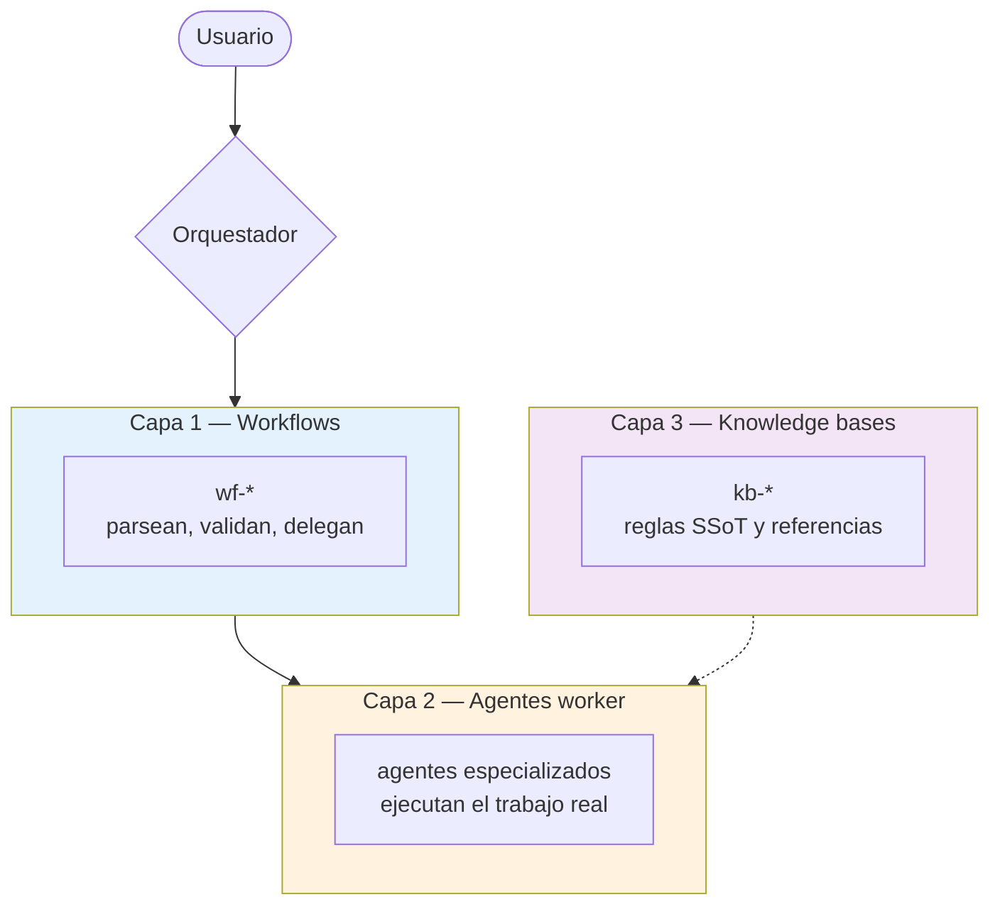

# SDD — Diagramas globales del sistema

Este documento contiene solo diagramas de comportamiento **global** del ecosistema SDD. Los detalles internos de cada fase viven en sus propios documentos:

- [sdd/prd/DIAGRAMS.md](prd/DIAGRAMS.md)
- [sdd/spec/DIAGRAMS.md](spec/DIAGRAMS.md)
- [sdd/design/DIAGRAMS.md](design/DIAGRAMS.md)
- [sdd/plan/DIAGRAMS.md](plan/DIAGRAMS.md)

Si vas a explicar el sistema a alguien nuevo, empieza aquí y baja después al directorio concreto que quieras detallar.

---

## 1. Pipeline end-to-end

**Pregunta que responde:** ¿cuál es el recorrido completo desde requisitos hasta implementación?

```mermaid
flowchart LR
    PRD["Etapa 0<br/>PRD"]
    SPEC["Etapas 1-2<br/>Spec + Decompose"]
    DESIGN["Etapa 3<br/>Design"]
    PLAN["Etapa 4<br/>Plan"]
    TASKS["Etapa 5<br/>Tasks"]
    IMPL["Implementacion<br/>agentes KMM"]

    PRD -->|"wf-prd-review<br/>wf-spec-analyze"| SPEC
    SPEC -->|"feature specs listos"| DESIGN
    DESIGN -->|"contrato visual validado<br/>DESIGN.md + flows/views/ui_prompt"| PLAN
    PLAN -->|"feature_plan.md"| TASKS
    TASKS -->|"feature_tasks.md"| IMPL

    style PRD fill:#e3f2fd,stroke:#1976d2
    style SPEC fill:#fff3e0,stroke:#f57c00
    style DESIGN fill:#f3e5f5,stroke:#8e24aa
    style PLAN fill:#e8f5e9,stroke:#388e3c
    style TASKS fill:#e0f2f1,stroke:#00897b
    style IMPL fill:#fce4ec,stroke:#d81b60
```

**Mensaje clave:** el pipeline ya no salta directamente de spec a plan. `design` es una fase explícita para validar interfaz y flujos antes de fijar implementación.

---

## 2. Frontera entre artefactos

**Pregunta que responde:** ¿qué tipo de verdad pertenece a cada etapa?

```mermaid
flowchart LR
    subgraph PRD["PRD"]
        P1["Problema, actores, alcance"]
        P2["Reglas de negocio y exclusiones"]
    end

    subgraph SPEC["Spec"]
        S1["Historias de usuario"]
        S2["Journeys, CAs, comportamiento observable"]
    end

    subgraph DESIGN["Design"]
        D0["DESIGN_BRIEF.md (gate)"]
        D1["DESIGN.md"]
        D2["Flows, views, prompt Stitch"]
    end

    subgraph PLAN["Plan"]
        T1["Stack, modulos, capas, contratos"]
    end

    PRD --> SPEC
    SPEC --> DESIGN
    DESIGN --> PLAN

    style PRD fill:#e3f2fd,stroke:#1976d2
    style SPEC fill:#fff3e0,stroke:#f57c00
    style DESIGN fill:#f3e5f5,stroke:#8e24aa
    style PLAN fill:#e8f5e9,stroke:#388e3c
```

**Mensaje clave:** PRD decide negocio, Spec decide comportamiento, Design decide presentacion y contrato visual, Plan decide implementacion.

---

## 3. Arquitectura transversal de capas

**Pregunta que responde:** ¿cómo se organiza internamente cada fase del ecosistema?

**Mensaje clave:** la misma arquitectura se repite en PRD, Spec, Design, Plan y Tasks. El detalle de qué workflows, agentes y kb participan en cada fase está en su `DIAGRAMS.md` local.

---

## Orden de lectura recomendado

1. Este archivo para entender el mapa global.
2. [sdd/prd/DIAGRAMS.md](prd/DIAGRAMS.md) para entrada y gobernanza de cambios.
3. [sdd/spec/DIAGRAMS.md](spec/DIAGRAMS.md) para generación y mantenimiento de specs.
4. [sdd/design/DIAGRAMS.md](design/DIAGRAMS.md) para Stitch, `DESIGN.md` y prototipado por feature.
5. [sdd/plan/DIAGRAMS.md](plan/DIAGRAMS.md) para el gate técnico entre Design y Tasks.
