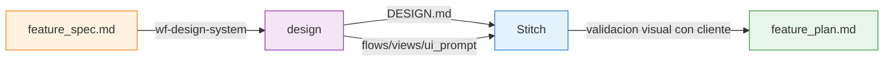
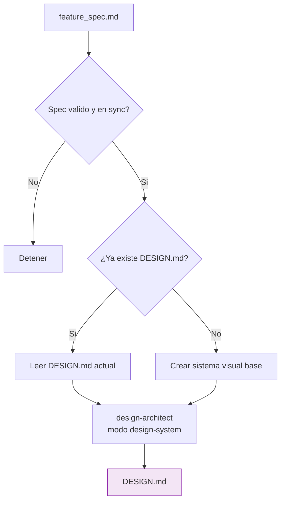
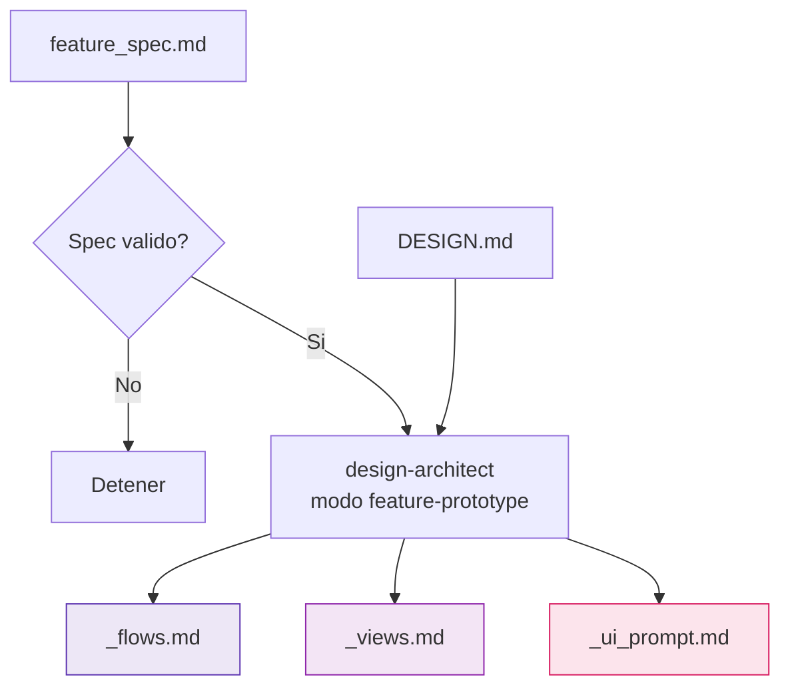
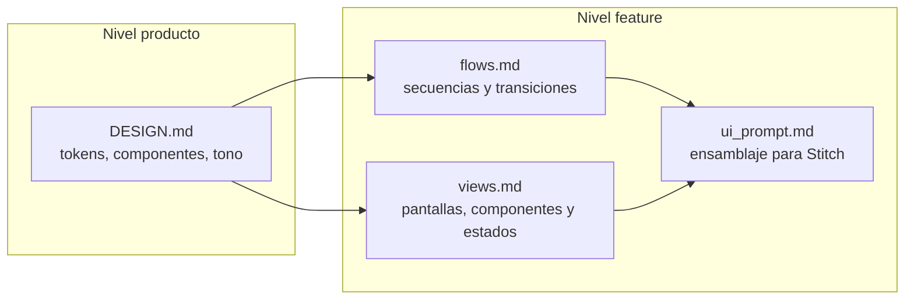
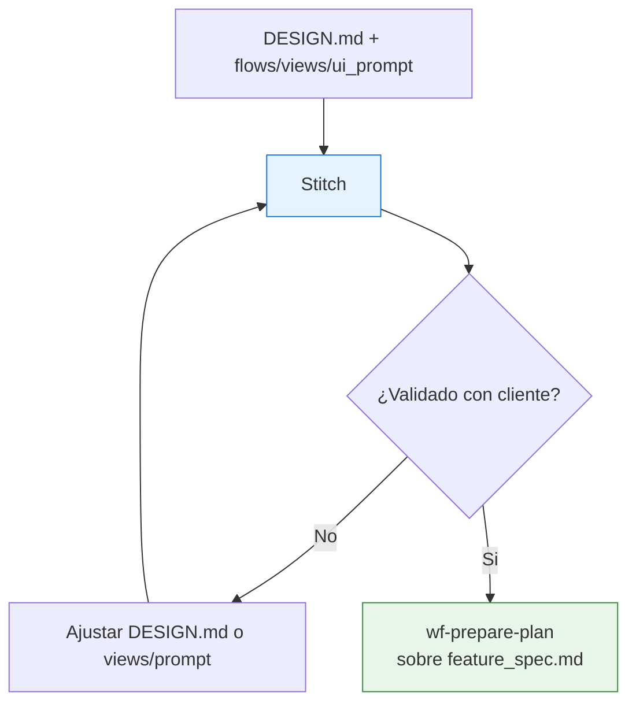

# SDD Design — Diagramas de la fase de prototipado visual

Este documento contiene los diagramas detallados de la fase `design`: sistema visual, derivacion de vistas por feature y handoff a Stitch y a `plan`.

Para la vista global del sistema, usa [sdd/DIAGRAMS.md](/Users/oscar/Documents/GitHub/ai-dev-agents-lab/sdd/DIAGRAMS.md).

---

## 1. Posicion de Design en el pipeline

**Pregunta que responde:** ¿que resuelve `design` entre `spec` y `plan`?

**Mensaje clave:** `design` sirve para cerrar interfaz y flujos antes de cristalizar decisiones tecnicas en el plan.

---

## 2. Flujo interno de `wf-design-system`

**Pregunta que responde:** ¿como se genera o actualiza el `DESIGN.md` de producto?

**Mensaje clave:** `DESIGN.md` es un artefacto de producto persistente, no algo efimero por feature.

---

## 3. Flujo interno de `wf-design-feature-prototype`

**Pregunta que responde:** ¿como se derivan los artefactos listos para Stitch desde un spec?

**Mensaje clave:** la fase produce tres artefactos distintos para evitar que todo el contrato visual quede enterrado dentro de un prompt.

---

## 4. Contrato de artefactos en Design

**Pregunta que responde:** ¿que aporta cada archivo de la fase?

**Mensaje clave:** `DESIGN.md` define identidad reusable; `flows` captura el comportamiento navegacional; `views` es la SSoT de pantalla; `ui_prompt` solo ensambla todo eso para Stitch.

---

## 5. Handoff desde Design hacia Stitch y Plan

**Pregunta que responde:** ¿como se usa la salida de design despues de generarla?

**Mensaje clave:** el plan no nace del mockup, sino del spec ya validado con el contrato visual despejado.
