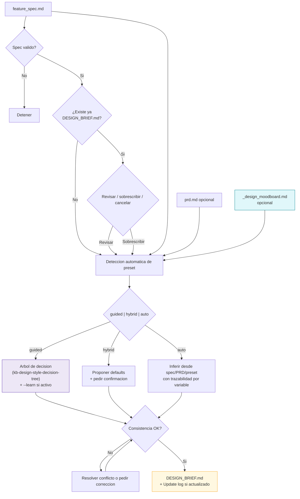
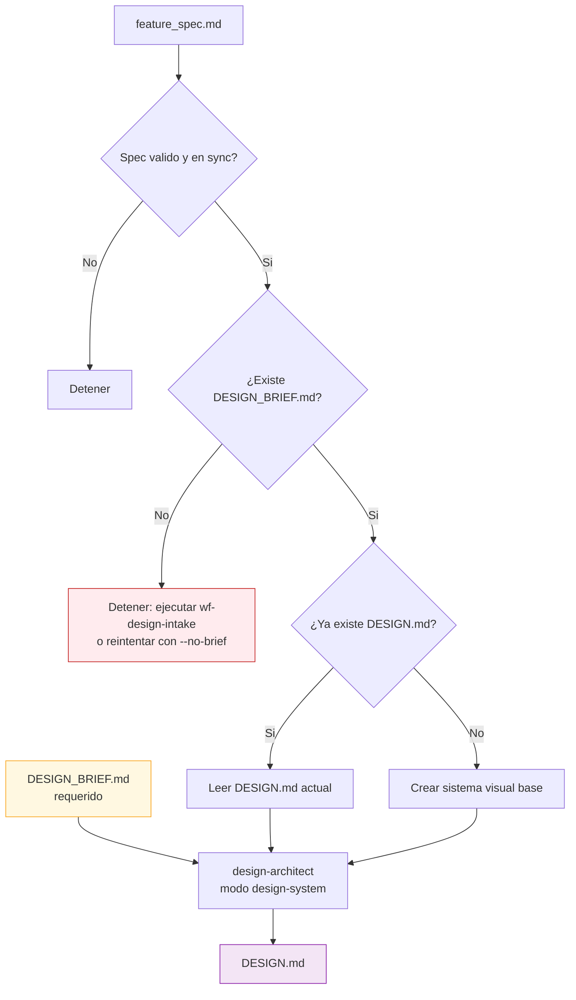
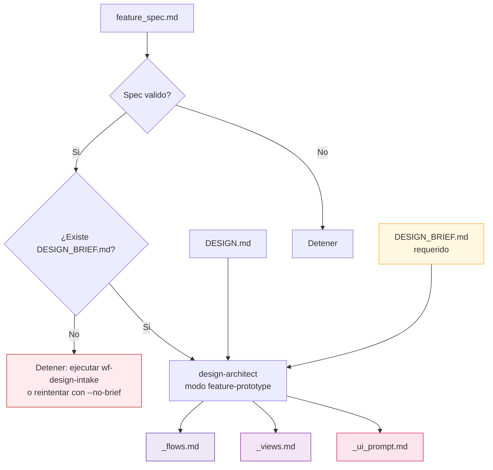
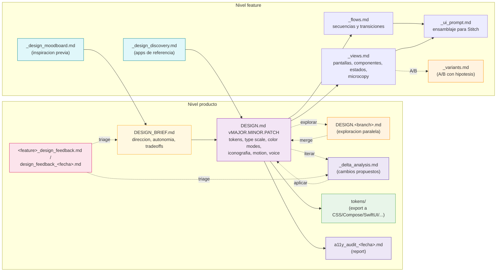
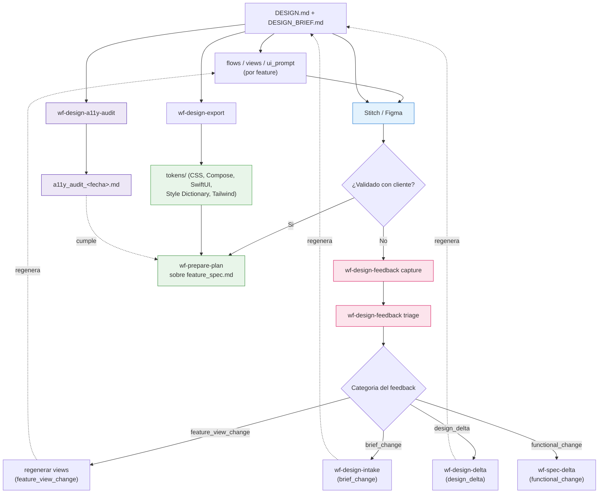
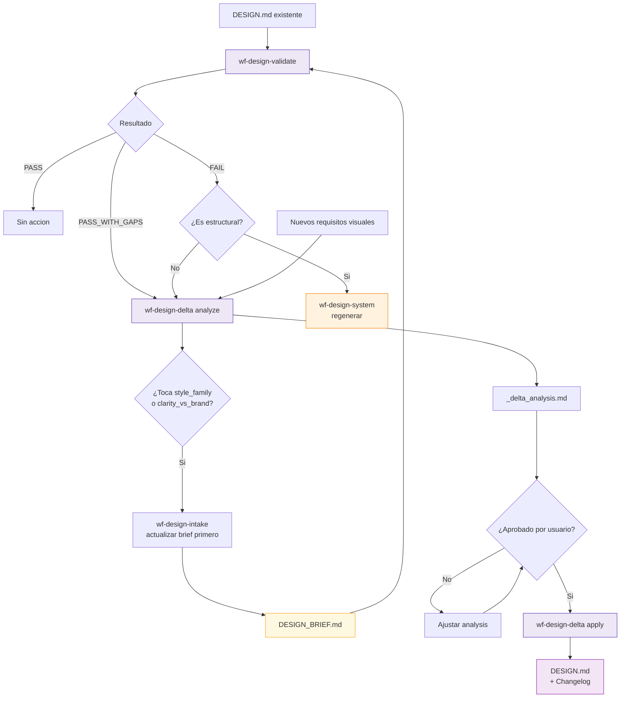
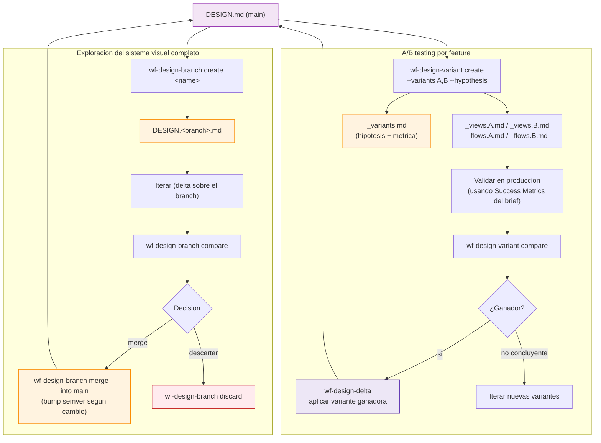
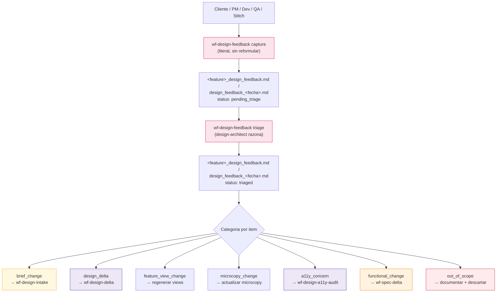

# SDD Design — Diagramas de la fase de prototipado visual

Este documento contiene los diagramas detallados de la fase `design`: intake de direccion visual, sistema visual, derivacion de vistas por feature y handoff a Stitch y a `plan`.

Para la vista global del sistema, usa [sdd/DIAGRAMS.md](../DIAGRAMS.md).

---

## 1. Posicion de Design en el pipeline

**Pregunta que responde:** ¿que resuelve `design` entre `spec` y `plan`?

```mermaid
flowchart LR
    SPEC["feature_spec.md"]
    MOOD["wf-design-moodboard<br/>(opcional)"]
    MOODFILE["_design_moodboard.md"]
    INTAKE["wf-design-intake"]
    BRIEF["DESIGN_BRIEF.md<br/>(gate obligatorio)"]
    DISCOVER["wf-design-discover<br/>(opcional)"]
    DISCOVERY["_design_discovery.md"]
    SYSTEM["wf-design-system"]
    DESIGN["DESIGN.md<br/>(semver)"]
    VALIDATE["wf-design-validate"]
    A11Y["wf-design-a11y-audit"]
    DELTA["wf-design-delta"]
    BRANCH["wf-design-branch"]
    VARIANT["wf-design-variant"]
    FEATURE["wf-design-feature-prototype"]
    BUNDLE["flows / views / ui_prompt"]
    EXPORT["wf-design-export"]
    TOKENS["tokens/<br/>(CSS, Compose, SwiftUI, ...)"]
    FEEDBACK["wf-design-feedback"]
    STITCH["Stitch"]
    PLAN["feature_plan.md"]

    SPEC --> MOOD
    MOOD --> MOODFILE
    SPEC --> INTAKE
    MOODFILE -.alimenta.-> INTAKE
    INTAKE --> BRIEF
    BRIEF --> DISCOVER
    DISCOVER --> DISCOVERY
    BRIEF --> SYSTEM
    DISCOVERY --> SYSTEM
    SPEC --> SYSTEM
    SYSTEM --> DESIGN
    DESIGN --> VALIDATE
    DESIGN --> A11Y
    DESIGN -. iterar .-> DELTA
    DELTA --> DESIGN
    DESIGN -. explorar .-> BRANCH
    BRANCH -. merge .-> DESIGN
    DESIGN --> FEATURE
    BRIEF --> FEATURE
    FEATURE --> BUNDLE
    SPEC -. A/B .-> VARIANT
    DESIGN -. A/B .-> VARIANT
    DESIGN --> EXPORT
    EXPORT --> TOKENS
    BUNDLE --> STITCH
    DESIGN --> STITCH
    STITCH -->|"validacion con cliente"| FEEDBACK
    FEEDBACK -. triage .-> INTAKE
    FEEDBACK -. triage .-> DELTA
    FEEDBACK --> PLAN
    TOKENS --> PLAN

    style SPEC fill:#fff3e0,stroke:#f57c00
    style MOOD fill:#e0f7fa,stroke:#00838f
    style MOODFILE fill:#e0f7fa,stroke:#00838f
    style INTAKE fill:#fff8e1,stroke:#f9a825
    style BRIEF fill:#fff8e1,stroke:#f9a825
    style DISCOVER fill:#e0f7fa,stroke:#00838f
    style DISCOVERY fill:#e0f7fa,stroke:#00838f
    style SYSTEM fill:#f3e5f5,stroke:#8e24aa
    style DESIGN fill:#f3e5f5,stroke:#8e24aa
    style VALIDATE fill:#ede7f6,stroke:#5e35b1
    style A11Y fill:#ede7f6,stroke:#5e35b1
    style DELTA fill:#ede7f6,stroke:#5e35b1
    style BRANCH fill:#fff3e0,stroke:#fb8c00
    style VARIANT fill:#fff3e0,stroke:#fb8c00
    style FEATURE fill:#f3e5f5,stroke:#8e24aa
    style BUNDLE fill:#fce4ec,stroke:#d81b60
    style EXPORT fill:#e8f5e9,stroke:#43a047
    style TOKENS fill:#e8f5e9,stroke:#43a047
    style FEEDBACK fill:#fce4ec,stroke:#d81b60
    style STITCH fill:#e3f2fd,stroke:#1976d2
    style PLAN fill:#e8f5e9,stroke:#388e3c
```

**Mensaje clave:** la fase opera en siete capas con responsabilidad unica: inspiracion (`moodboard`), intake (`brief`), discovery (`referencias`), generacion (`system` + `feature-prototype`), evolucion (`validate` + `delta`), exploracion (`branch` + `variant`) y handoff (`export` + `a11y-audit` + `feedback`). El `DESIGN_BRIEF.md` es gate obligatorio para todo lo que va aguas abajo.

---

## 2. Flujo interno de `wf-design-intake`

**Pregunta que responde:** ¿como se cierra el `DESIGN_BRIEF.md` antes del sistema visual?

**Mensaje clave:** el brief reduce decisiones implicitas y deja trazado quien manda en las ambiguedades del estilo. El intake detecta presets automaticamente desde el contexto del producto, soporta moodboard previo y modo `--learn` para diseñadores junior.

---

## 3. Flujo interno de `wf-design-system`

**Pregunta que responde:** ¿como se genera o actualiza el `DESIGN.md` de producto?

**Mensaje clave:** `DESIGN.md` es un artefacto de producto persistente y no nace de inferencias libres: el `DESIGN_BRIEF.md` es precondicion obligatoria, salvo override explicito `--no-brief` para casos legacy.

---

## 4. Flujo interno de `wf-design-feature-prototype`

**Pregunta que responde:** ¿como se derivan los artefactos listos para Stitch desde un spec?

**Mensaje clave:** la fase produce tres artefactos distintos para evitar que todo el contrato visual quede enterrado dentro de un prompt. El brief es precondicion obligatoria: la feature debe heredar la misma policy de autonomia, `clarity_vs_brand` y `accessibility_target` que el sistema visual.

---

## 5. Contrato de artefactos en Design

**Pregunta que responde:** ¿que aporta cada archivo de la fase?

**Mensaje clave:** los artefactos a nivel **producto** capturan identidad persistente (brief, sistema visual versionado, tokens exportables, auditorias). Los artefactos a nivel **feature** materializan esa identidad en pantallas concretas y permiten experimentar (variantes, A/B). El feedback de stakeholders se canaliza siempre via captura + triage hacia el workflow apropiado.

---

## 6. Handoff desde Design hacia Stitch y Plan

**Pregunta que responde:** ¿como se usa la salida de design despues de generarla?

**Mensaje clave:** el handoff a `plan` no es un dump del DESIGN.md: requiere tokens exportables (`wf-design-export`), validacion a11y ejecutiva (`wf-design-a11y-audit`) y procesado estructurado del feedback de cliente via captura + triage hacia el workflow correcto. El plan no nace del mockup, sino del spec con el contrato visual validado y los tokens listos para codigo.

---

## 7. Ciclo de auditoria y evolucion del sistema visual

**Pregunta que responde:** ¿como se mantiene `DESIGN.md` saludable a lo largo del tiempo?

**Mensaje clave:** `wf-design-validate` detecta gaps sin escribir; `wf-design-delta` los aplica preservando lo previo y dejando rastro en `## Changelog` con bump de version semver. Las mutaciones que tocan `style_family` o `clarity_vs_brand` son cambios de brief — pasan primero por `wf-design-intake`.

---

## 8. Exploracion paralela y A/B testing

**Pregunta que responde:** ¿como se prueban hipotesis visuales sin romper production?

**Mensaje clave:** `wf-design-branch` opera a nivel **sistema** (probar otra direccion visual completa); `wf-design-variant` opera a nivel **feature** (probar dos versiones de la misma pantalla con metrica). Ninguno toca `DESIGN.md` principal hasta que se decide merge o aplicar ganador. Las exploraciones que terminan sin merge se descartan limpiamente.

---

## 9. Loop de feedback de stakeholders

**Pregunta que responde:** ¿como se incorpora el feedback no estructurado (cliente, PM, dev, QA) sin perder trazabilidad?

**Mensaje clave:** el feedback se captura literal y se triajea en una de siete categorias accionables. Cada categoria activa el workflow correcto. Esto evita el patron "el cliente dijo algo y nadie sabe que hacer con ello": queda traza del feedback original, del triage y del workflow que lo aplico.
