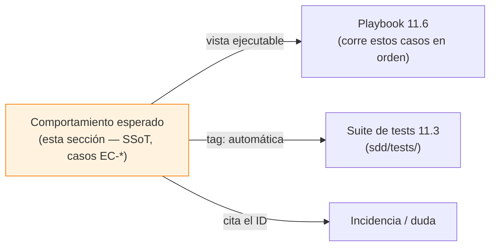

# Comportamiento esperado

Esta sección es el **contrato de comportamiento observable del propio ecosistema**:
para cada flujo y cada *edge case* que el sistema tiene controlado, qué debe hacer
exactamente. Es la "Spec del SDD" — sus propios Criterios de Aceptación.

Sirve para dos cosas:

1. **Verificar** que el ecosistema hace lo que debe mientras lo usas.
2. **Reportar** desviaciones y aclarar dudas con un lenguaje común: cada caso tiene
   un ID estable y citable.

!!! tip "El uso típico"
    Ves un comportamiento que te sorprende → buscas el caso aplicable aquí →
    comparas → si **diverge** del comportamiento esperado, abres una incidencia
    citando el ID (ver [Cómo reportar](#como-reportar)).

---

## El esquema de identificadores

Cada caso es `EC-<ÁREA>-NNN` (EC = *escenario / caso de comportamiento*):

| Área | Prefijo | Qué cubre |
|---|---|---|
| Arranque y sesión | `EC-INIT` | Wizard de modo, init, estados de sesión, version-drift |
| Generación de specs | `EC-SPEC` | analyze, discovery, features-first, characterization, marcadores |
| Fase Design | `EC-DSGN` | intake (gate), system, prototype, extract |
| Gates de fase | `EC-GATE` | Bloqueos `PreToolUse` en negativo (anti-alucinación) |
| Plan, tasks y entrega | `EC-DELIV` | Sellado, máquina de estados, QA, release |
| Mantenimiento y cambios | `EC-MAINT` | Triaje de bug, cambio de producto, enmienda |
| Robustez e instalación | `EC-ROBUST` | update, `--prune`, layout legacy, subdirectorio, CI |
| Enrutado por lenguaje natural | `EC-ROUTE` | El orquestador mapea intención → skill + args |

Los IDs **no se reutilizan**: si un caso se retira, su número queda libre pero no se
reasigna (igual que los CAs de un spec).

---

## El formato de un caso

Cada caso es deliberadamente técnico y verificable:

```
### EC-GATE-003 — wf-prepare-tasks con plan en BORRADOR
**Disparador (GIVEN/WHEN):** existe un _plan.md con Estado: BORRADOR y el
  usuario pide generar las tasks.
**Comportamiento esperado (THEN):** el hook PreToolUse deniega con
  "[SDD-GATE] wf-prepare-tasks: …Ejecuta /wf-plan-validate…" y NO se crea
  ningún _tasks.md.
**Verificación:** automática (`tests/test_sdd_gate_check.py`) · también manual.
**Cuenta como desviación si:** se generan tasks, o el bloqueo no aparece.
```

- **Disparador** — la precondición y la acción del usuario.
- **Comportamiento esperado** — qué hace el sistema, **qué NO hace**, y el mensaje
  literal cuando aplica.
- **Verificación** — cómo se comprueba: `automática` (con el test que lo cubre),
  `manual` (lo juzga un humano), o ambas.
- **Cuenta como desviación si** — el criterio de fallo, sin ambigüedad.

---

## Relación con el resto



- El **playbook de testeo manual** (ROADMAP 11.6) no duplica estos casos: es la guía
  de "ejecútalos en este orden", y referencia los `EC-*`.
- La **suite de tests** (ROADMAP 11.3) automatiza el subconjunto determinista; cada
  caso indica si está auto-cubierto y por qué test.
- Una **incidencia** contra el sistema cita el `EC-*` que se incumple.

---

## Cómo reportar

Si observas una desviación de un caso:

1. Reúne lo que dice el caso (el ID y el comportamiento esperado) y lo que realmente
   pasó (mensaje, artefacto creado o no, estado).
2. Abre una incidencia con la plantilla **"Desviación de comportamiento"**
   (`.github/ISSUE_TEMPLATE/desviacion-comportamiento.md`): pide el ID `EC-*`, qué
   esperabas, qué ocurrió y cómo reproducir.

Reportar contra un ID convierte "esto no va bien" en "EC-GATE-003 no se cumple en
estas condiciones" — accionable y trazable.

!!! warning "Cobertura en construcción"
    El catálogo se está poblando área por área. La primera área completa y modelo de
    todas es **[Gates de fase (en negativo)](gates.md)** — los bloqueos
    anti-alucinación, lo más crítico de verificar.
