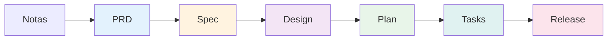
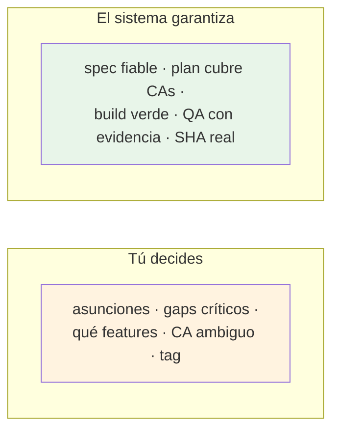

# Tu primera feature

Este recorrido lleva una idea informal hasta una feature **implementada, verificada
y liberada**, pasando por todo el pipeline. El objetivo no es que memorices
comandos —no los tecleas— sino que veas **qué pides, qué hace el sistema y dónde se
detiene a preguntarte**.

!!! warning "Artefactos ilustrativos"
    Los fragmentos de PRD, spec, etc. de esta página son **ejemplos** para que veas
    la forma, no salidas literales del sistema. Tu proyecto real generará su propio
    contenido.

El producto del ejemplo: una **app de notas rápida**. Vamos a llevar su feature de
**inicio de sesión** de punta a punta.



---

## Paso 1 — De notas a PRD

Tú escribes:

> *"Quiero una app de notas rápida: el usuario se registra con email, crea notas y
> las organiza por carpetas. Hazme el PRD."*

El orquestador invoca `wf-prd-create`. El agente `prd-expert` produce un borrador:

```markdown
# PRD — App de notas rápida
## Actores
- Usuario registrado
## Alcance (dentro)
- Registro e inicio de sesión con email
- Crear, editar y borrar notas
- Organizar notas en carpetas
## Fuera de alcance
- Compartir notas entre usuarios   [ASUNCIÓN ASN-001]
```

:material-account-alert: **Aquí decides tú.** No le diste detalles sobre compartir
notas, así que el sistema **no lo inventa en silencio**: lo marca `[ASN-001]` y, en
el review (`wf-prd-review`), te pregunta:

> *¿Confirmas que compartir notas queda fuera de alcance? (confirmar / rechazar / editar)*

Confirmas. El PRD queda `LISTO`.

---

## Paso 2 — Analyze (obligatorio)

> *"Genera las specs del PRD."*

Antes de generar nada, el sistema ejecuta `wf-spec-analyze` —el paso **obligatorio**—
y detecta huecos:

```markdown
## Gaps detectados
- [CRÍTICO] ¿El registro exige verificación de email?
- ¿Hay límite de notas por carpeta?
```

:material-account-alert: **Aquí decides tú.** Hay un gap `[CRÍTICO]`. El sistema se
detiene: respóndelo o autoriza continuar con un override explícito. Respondes:

> *"Sí, el registro verifica el email con un código de 6 dígitos."*

---

## Paso 3 — Descubrir features y elegir la primera

`wf-spec-features-first` descubre las features del PRD y te presenta el mapa:

| Feature | Nombre | Actor | RFs |
|---|---|---|---|
| F-001 | Inicio de sesión | Usuario | RF-01, RF-02 |
| F-002 | Gestión de notas | Usuario | RF-03, RF-04 |
| F-003 | Carpetas | Usuario | RF-05 |

:material-account-alert: **Aquí decides tú** qué entra en esta iteración:

> *"Empecemos solo por F-001, el login."*

El sistema genera el spec de F-001 (las demás quedan `PENDIENTE_GENERACIÓN`). El
spec contiene los CAs testables:

```markdown
## CA-001
GIVEN un email no registrado
WHEN el usuario envía el formulario de registro
THEN se crea la cuenta y se envía un código de 6 dígitos al email
```

---

## Paso 4 — Design (esta feature tiene UI)

El login tiene pantallas, así que la fase Design **no se salta**.

> *"Prepara el diseño del login."*

`wf-design-intake` cierra el `DESIGN_BRIEF.md` (te hace unas preguntas de dirección
visual), `wf-design-system` genera el `DESIGN.md` del producto, y
`wf-design-feature-prototype` deriva los artefactos de F-001:

```
features/inicio-sesion/design/inicio-sesion_flows.md
features/inicio-sesion/design/inicio-sesion_views.md
features/inicio-sesion/design/inicio-sesion_ui_prompt.md
```

El `_ui_prompt.md` está listo para pegar en Stitch.

!!! tip "Si no hubiera UI"
    Para una feature sin pantallas (un webhook, un job), el sistema saltaría
    directamente del Spec al Plan. Design es saltable por feature.

---

## Paso 5 — Plan técnico

> *"Genera el plan del login."*

`wf-prepare-plan` (agente `plan-architect`) traduce el *qué* a *cómo*, fundamentado
en tu repo. El gate ya verificó que el spec es fiable (sin marcadores, en sync).

```
features/inicio-sesion/plan/inicio-sesion_plan.md   → Estado: BORRADOR
```

> *"Valida el plan."*

`wf-plan-validate` no se fía del propio agente: `sdd-seal.py` comprueba que **todos
los CAs del spec están cubiertos**, que no hay gaps abiertos, etc. Solo entonces:

```
Estado: VALIDADO   ← lo escribe el script, no el agente
```

---

## Paso 6 — Tasks

> *"Crea las tasks."*

`wf-prepare-tasks` descompone el plan en pasos atómicos con dependencias y
trazabilidad:

```markdown
| Task  | Título                        | Deps  | CA     | Estado     |
|-------|-------------------------------|-------|--------|------------|
| T-001 | Modelo de usuario y repositorio | —     | CA-001 | PENDIENTE  |
| T-002 | Caso de uso de registro       | T-001 | CA-001 | PENDIENTE  |
| T-003 | Pantalla de registro          | T-002 | CA-002 | PENDIENTE  |
```

---

## Paso 7 — Ejecutar

> *"Implementa la siguiente task."*

`wf-task-run --next` toma T-001, delega a su owner, implementa, **ejecuta build y
tests reales**, y hace un commit:

```
✓ T-001 HECHA — build verde, 4 tests pasando
  commit: "T-001: Modelo de usuario y repositorio [CA-001]"
```

Repites para T-002, T-003… El estado vive en el `_tasks.md` y lo escribe solo el
script.

:material-account-alert: **Si al implementar T-003 vieras que un CA es ambiguo**, el
owner no inventa la interpretación: lo reporta y tú lanzas `wf-spec-amend` para
aclararlo, sin rehacer todo el pipeline.

---

## Paso 8 — QA y release

> *"Verifica la cobertura de QA."*

`wf-qa-verify` ejecuta los tests por cada `TC-XXX` y emite veredicto:

```
CA-001 → CUBIERTO (2 tests ejecutados, verdes)
CA-002 → CUBIERTO
Veredicto: APTO
```

> *"Cierra la feature y etiquétala v0.1.0."*

`wf-release` confirma que QA está `APTO`, captura el commit SHA **con git** y
registra la coordenada:

```
R-001 — v0.1.0 — SHA a3b4c5d — APTO
```

---

## Lo que acabas de ver



La cadena completa quedó trazada: **`RF → HU → CA → TC → task → commit → release`**.
Cada eslabón apunta al anterior, y ninguno se cerró sin el suyo.

A partir de aquí: genera F-002 y F-003 en las siguientes iteraciones, o profundiza
en tu perfil —[desarrollador](../guias/desarrollador.md),
[producto](../guias/producto.md), [diseñador](../guias/disenador.md)— y en el
[porqué del diseño](../entender/funcional.md).
