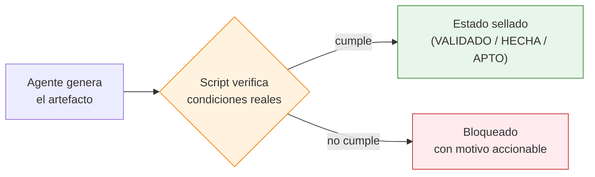
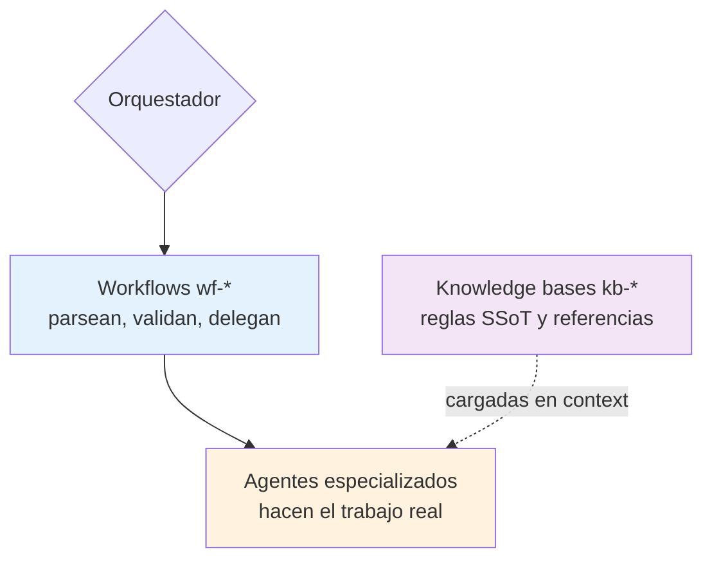
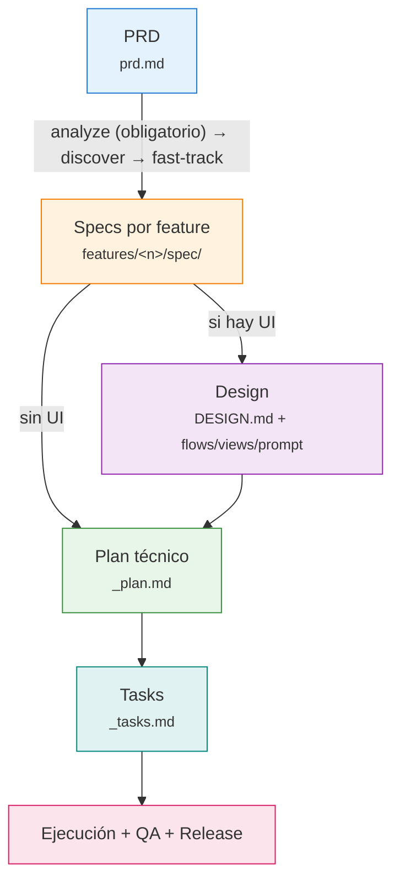
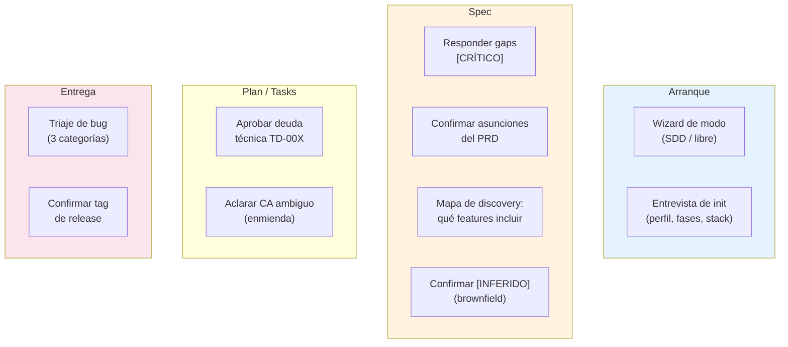

# Visión funcional del sistema

Este documento explica **qué es** el ecosistema SDD, **por qué** está construido
como está y **dónde decide el humano**. No es una receta de uso (eso son las
[guías por perfil](../guias/desarrollador.md)); es el modelo mental que necesitas
para entender el sistema —o para tocarlo sin romper sus garantías.

---

## Las cuatro premisas

Todo el diseño se deriva de cuatro ideas. Si entiendes estas, el resto del sistema
es consecuencia.

### 1. Spec-driven: separar el *qué* del *cómo*

El conocimiento de un producto se descompone en capas de verdad, y cada fase posee
**una sola**:

| Fase | Decide | Pregunta que responde |
|---|---|---|
| **PRD** | Negocio | ¿Qué problema, para quién, con qué alcance? |
| **Spec** | Comportamiento | ¿Qué hace el sistema, observable, sin tecnología? |
| **Design** | Presentación | ¿Cómo se ve y se navega? |
| **Plan** | Implementación | ¿Cómo se construye, con qué stack y módulos? |
| **Tasks** | Ejecución | ¿Qué pasos atómicos y en qué orden? |

La frontera Spec↔Plan se decide con la **Prueba de Pureza**:

!!! quote "Prueba de Pureza"
    *"¿Cambiaría esta frase si pasáramos de KMM a web, o de Kotlin a Python?"*

    - **SÍ** → es un detalle técnico → pertenece al Plan.
    - **NO** → es funcional → puede estar en el Spec.

Mezclar capas es el error de diseño más caro: un Spec con tecnología prematura ata
decisiones que aún no toca tomar; un Plan que redefine comportamiento rompe la
trazabilidad al negocio.

### 2. Anti-alucinación: nada se afirma sin evidencia

Un LLM rellena huecos plausibles por defecto. El ecosistema lo combate con una
regla transversal: **toda afirmación traza a una fuente, o se marca explícitamente
como hueco**.

- En el PRD, una afirmación de negocio sin material fuente se marca `[ASUNCIÓN]` y
  se confirma con el humano en el review.
- En el Spec, un criterio sin definir es `[INCOMPLETO]`; un gap del pipeline es
  `[CRÍTICO]`.
- En specs de *characterization* (brownfield), un comportamiento sin evidencia en
  el código es `[INFERIDO]`.

La regla de oro se repite en cada fase: **lo que no se puede evidenciar, no existe**
(un CA sin evidencia, una cobertura de QA sin test ejecutado, una release sin
commit). Los marcadores no son decorativos: **bloquean** el avance de fase
(ver premisa 3).

### 3. Autor ≠ verificador: la confianza es mecánica, no de buena fe

El punto débil de cualquier sistema basado en prompts es la prosa "verifica que X":
el mismo flujo que genera un artefacto no puede ser quien certifica que está bien.
Por eso los gates críticos los ejecuta un **script determinista**, no el agente.

Ejemplos: `sdd-seal.py` no sella un plan si falta un solo `CA-XXX` del spec;
`sdd-task-state.py` es el **único** que escribe el estado de una task;
`sdd-release.py` captura el commit SHA con `git`, no se teclea. El veredicto "OK"
en prosa del agente ya no basta. Esta es la diferencia entre documentación que
*puede* mentir y un sistema que *no puede*.

### 4. Conocimiento por capas: cada saber en su sitio

El sistema se organiza en tres capas, repetidas en todas las fases:

El **orquestador** mapea intención → workflow; **no** ejecuta el trabajo ni
construye prompts a mano. El **workflow** recoge requisitos, verifica
precondiciones y delega. El **agente** explora, escribe o audita con sus `kb-*`
cargadas. Cada capa decide solo a su nivel. *(El porqué técnico de esta separación
—coste de contexto, carga eager vs lazy— está en [diseño técnico](tecnico.md).)*

---

## El pipeline y qué produce cada fase

- **PRD** — documento de negocio: actores, alcance dentro/fuera, reglas. No
  contiene tecnología. `wf-prd-create` ayuda a redactarlo; `wf-prd-review` lo limpia.
- **Spec** — comportamiento observable por feature: Historias de Usuario, Journeys
  y **Criterios de Aceptación** en formato `GIVEN/WHEN/THEN` testables. El paso
  `wf-spec-analyze` es **obligatorio**; `wf-spec-features-first` orquesta el
  descubrimiento de features y la generación en paralelo.
- **Design** — *fase saltable por feature*: solo si hay superficie de UI. Cierra el
  `DESIGN_BRIEF.md` (gate), genera el `DESIGN.md` de producto y los artefactos por
  feature (flows, views, ui_prompt para Stitch).
- **Plan** — el *cómo* técnico, fundamentado en la realidad del repo. Se sella a
  `VALIDADO` solo si pasa el verificador.
- **Tasks** — pasos atómicos `T-00X` con dependencias, owner y trazabilidad al
  `CA-XXX`.
- **Ejecución** — `wf-task-run` implementa con estado persistente y un commit por
  task; `wf-qa-verify` certifica cobertura con evidencia; `wf-release` ancla el
  cierre a un commit/tag.

La cadena de trazabilidad completa es **`RF → HU → CA → TC → task → commit →
release`**: cada eslabón apunta al anterior, y ningún eslabón se cierra sin el suyo.

---

## Los caminos reales (no solo greenfield)

El error de muchos pipelines es conocer solo "feature nueva desde cero". El SDD
cubre los flujos que representan el trabajo real de una empresa:

=== "Greenfield (vía PRD)"

    El camino feliz: notas → PRD → analyze → features-first → design → plan →
    tasks → ejecución → release. Es el recorrido completo descrito arriba.

=== "Brownfield (vía characterization)"

    El software ya existe. `wf-spec-from-code` hace ingeniería inversa: genera
    specs de *characterization* ("esto es lo que el sistema hace hoy, verificado
    contra el código") con CAs derivados de comportamiento observable. El espejo en
    Design es `wf-design-extract` (deriva el `DESIGN.md` de la UI en producción).
    Ambos **se detienen en un gate humano** tras descubrir, antes de generar.

=== "Iteración por subset"

    No hace falta generar todas las features de golpe. `wf-spec-features-first
    --features F-001,F-002` procesa un subconjunto; las demás quedan
    `PENDIENTE_GENERACIÓN` y se generan en pasadas posteriores sin perder estado.

=== "Cambio de producto"

    Un cambio de scope entra por `wf-prd-change`, mide impacto con
    `wf-prd-sync-impact` y resincroniza specs con `wf-spec-sync-from-prd`. Para
    encadenar toda la cascada en un comando, parando solo en los checkpoints
    humanos reales: `wf-prd-change-cascade`.

=== "Mantenimiento (bugs)"

    Un bug es *divergencia entre spec y código*, no un cambio de spec. `wf-bug`
    triajea en `CODE_BUG` / `SPEC_CHANGE` / `UNSPEC` **antes** de tocar código, y
    solo escala a `wf-spec-delta` si el comportamiento esperado cambia.

=== "Multi-stack (overlay)"

    El pipeline es stack-agnóstico; un *overlay* (p. ej. KMM) especializa Plan y
    Tasks sustituyendo agentes y KBs por su variante. El contrato de overlay
    garantiza que las piezas base y las del stack componen sin pisarse.

Además, el pipeline tiene un **modo ligero** declarado: para features pequeñas o
sin UI, reduce lo *proporcional* (≥1 CA en vez de ≥3, núcleo de 4 secciones,
design opcional) **sin relajar los invariantes** (CAs testables, trazabilidad, los
marcadores siguen bloqueando). No es un atajo que rompe garantías: es proporción.

---

## Decisiones de diseño y su porqué

Las decisiones no obvias del sistema, con su razón. Esto es lo que un contribuidor
necesita entender para no "corregir" algo que es intencional.

| Decisión | Por qué |
|---|---|
| **Gates mecánicos (hooks `PreToolUse`)** en vez de prosa "no avances si…" | Un gate auto-aprobable no es un gate. El hook deniega con evidencia positiva; sin evidencia, permite (conservador: nunca bloquea por accidente). |
| **`[INFERIDO]` bloquea como `[INCOMPLETO]`** en brownfield | Una inferencia sin evidencia es una alucinación con buena presentación. Se confirma con el humano (`wf-spec-gap-resolve`) antes de avanzar. |
| **Layout de feature por subcarpetas** (`spec/ design/ plan/ tasks/`) + soporte del plano legacy | Aísla artefactos por fase y escala; el legacy se lee sin migrar para no romper proyectos existentes. |
| **Registro por feature** (`_bugs.md`, `_qa_plan.md`, `_release.md`) | La trazabilidad vive junto a la feature, no en un ledger global que se desincroniza. |
| **Infra única con rules *lazy*** | El conocimiento pesado solo se carga cuando la fase lo necesita; el coste fijo de contexto es mínimo. *(detalle en [técnico](tecnico.md))* |
| **`_features.md` como índice generado**, no editado a mano | Un índice escrito por prosa miente en silencio; generado por `sdd-features-index.py` no puede. |
| **Verdad mecánica > auto-reporte** (KB Load Status, sellados, estados) | El auto-reporte del agente es señal secundaria; la autoridad es el script. |

---

## El contrato humano-sistema: dónde decides tú

El sistema es autónomo *entre* checkpoints, pero se **detiene a preguntarte** en los
puntos donde la decisión es genuinamente humana. Conocer este mapa es saber cuándo
esperar una pregunta —y desconfiar si no llega.

| Momento | Qué decides | Quién lo materializa |
|---|---|---|
| Proyecto nuevo | Modo SDD o libre | Wizard (`AskUserQuestion`) |
| Init | Perfil, fases a instalar, stack | `wf-project-init` |
| Tras analyze | Responder gaps `[CRÍTICO]` o continuar con override | Tú, antes de discovery |
| Review de PRD | Confirmar/rechazar cada `[ASUNCIÓN]` | `wf-prd-review` (gate) |
| Tras discovery | Qué features entran en esta iteración | Tú, sobre el mapa |
| Brownfield | Confirmar cada `[INFERIDO]` | `wf-spec-gap-resolve` |
| Plan con deuda | Aprobar/rechazar cada `TD-00X` | `wf-plan-validate` |
| CA ambiguo al implementar | Aclaración (no cambio de comportamiento) | `wf-spec-amend` |
| Bug | Categoría de triaje | `wf-bug`, antes de tocar código |
| Release | Si se etiqueta y con qué tag | `wf-release` |

!!! note "Para profundizar"
    - El *cómo* de uso de cada perfil: [guías](../guias/desarrollador.md).
    - El *cómo* técnico (capas, carga, enforcement, paths, overlay, trampas):
      [diseño técnico](tecnico.md).
    - El histórico de decisiones con su evidencia: `docs/ROADMAP.md` (interno).
