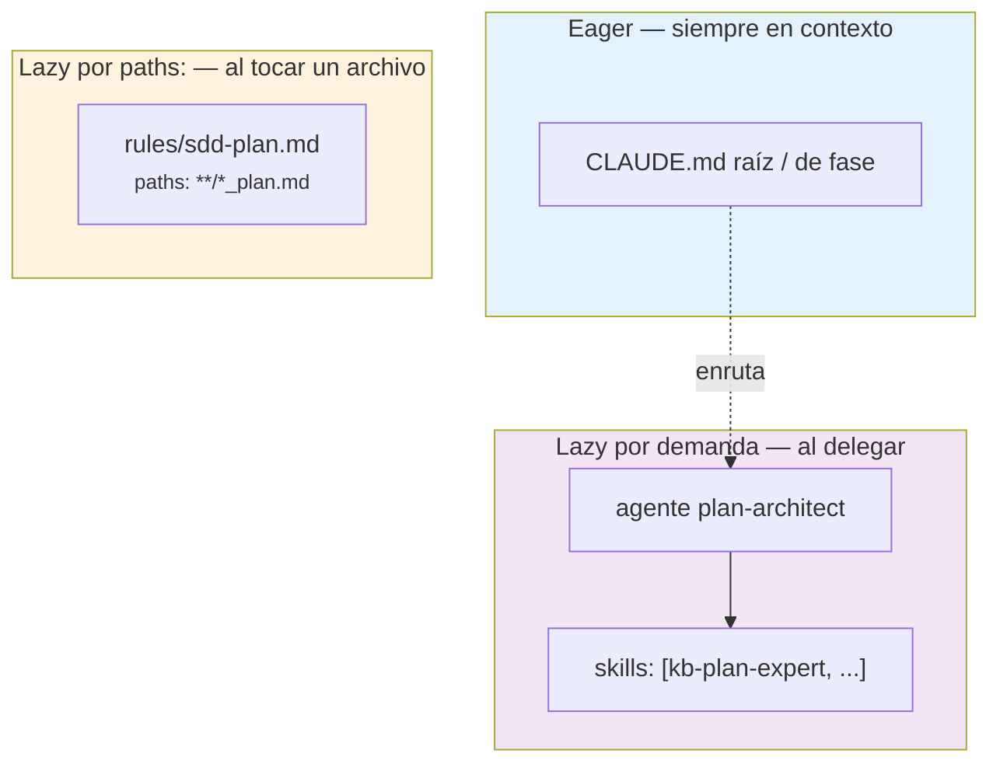
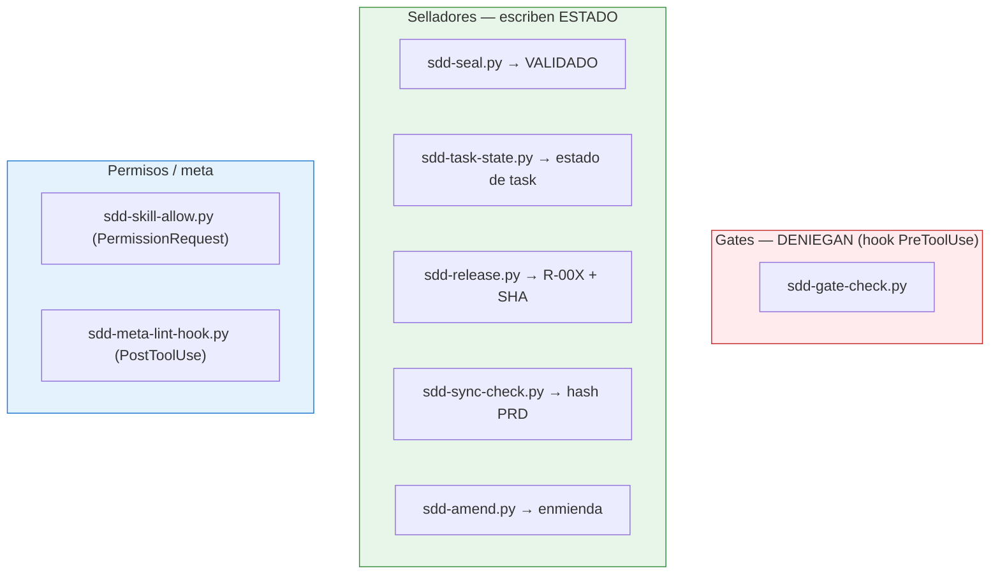
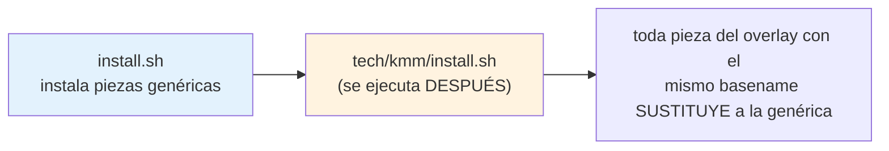

# Diseño técnico (IA)

Este documento explica **cómo** está construido el ecosistema a nivel de
ingeniería de contexto: por qué cada conocimiento vive donde vive, cómo se carga,
cómo se resuelven rutas y, sobre todo, **cómo el enforcement convierte la prosa en
garantías mecánicas**. Es la lectura para quien va a modificar el sistema.

Si vienes de la [visión funcional](funcional.md), aquí está el *cómo* de sus
cuatro premisas.

---

## El contrato de capas: dónde vive cada saber

El recurso escaso de un agente LLM es el **contexto**. Cada token que ocupas con
conocimiento que *quizá* no necesitas es un token que no está disponible para el
razonamiento. El sistema reparte el conocimiento en cinco soportes según **cuándo**
se necesita y **cuánto cuesta tenerlo cargado**.

| Soporte | Qué contiene | Cuándo se carga | Coste fijo |
|---|---|---|---|
| **`CLAUDE.md`** (raíz + fase) | Rootmap intención→workflow, principios del orquestador | *Eager*: siempre en sesión | Su cuerpo completo |
| **Rules de fase** (`.claude/rules/sdd-<fase>.md`) | Marcador de fase de cuerpo fino: intro + nota "Audiencia" + puntero a `sdd-routing.md`/registry (sin rootmap — D-023); activado por archivo | *Lazy por `paths:`*: al tocar un archivo que matchea | Solo el frontmatter |
| **Rule de orquestación** (`.claude/rules/sdd-orchestration.md`) | Disciplina transversal (readiness mecánica, orden del pipeline, no bypasear gates) | *Eager* — una rule **sin `paths:`** carga al arrancar, como un `CLAUDE.md` | Su cuerpo completo (deliberadamente fino) |
| **Rule de enrutado** (`.claude/rules/sdd-routing.md`) | Desambiguación y precondiciones/fronteras de fase que las `description` no cubren (p. ej. "crea specs → features-first, no discover") | *Eager* (sin `paths:`); ensamblada topology-gated de las fases instaladas | Su cuerpo (solo desambiguación, no el rootmap) |
| **kb-\*** (knowledge bases) | Reglas SSoT y referencias de una fase | *Lazy*: cuando un agente las declara | Solo su `description` |
| **wf-\*** (workflows) | Procedimiento: parsea, valida, delega | *Lazy*: al invocar la skill | Solo su `description` |
| **Agentes** | El worker que ejecuta, con sus kb-\* inyectadas | *Lazy*: al delegar en él | Su frontmatter |

La regla de reparto es: **conocimiento de enrutado → CLAUDE.md (eager); conocimiento
de dominio → kb (lazy en el agente que lo usa); procedimiento → wf**. El coste fijo
que paga el sistema en cada sesión es solo el conjunto de `description`s — todo lo
pesado se trae bajo demanda.

> **Matiz (D-022 / D-023):** el enrutado intención→skill lo hacen de hecho las
> `description` (eager por diseño). El rootmap-tabla llegó a vivir en las reglas de
> fase como referencia y **se eliminó** (D-023) por redundante y no load-bearing: la
> regla de fase queda como marcador fino. Lo que sí necesita carril eager propio es la
> **desambiguación** que la `description` no puede expresar (skills de la misma fase,
> precondiciones de frontera): eso vive en `sdd-routing.md`.

!!! info "Por qué el orquestador no usa las kb-* directamente"
    El `CLAUDE.md` raíz es deliberadamente fino: solo mapea intención a workflow.
    Las `kb-*` viven en los subagentes, no en el orquestador, porque cargarlas
    arriba pagaría su coste en *toda* sesión aunque no se use esa fase. El
    orquestador delega; el agente carga su dominio.

---

## Mecánica de carga: eager vs lazy



**Rules — carga lazy por `paths:`.** `install.sh` genera una rule por fase
envolviendo el `CLAUDE.md` de esa fase con un frontmatter de globs. El harness solo
inyecta la rule cuando el usuario toca un archivo que matchea:

```yaml
---
paths:
  - "**/*_plan.md"
---
# (cuerpo = CLAUDE.md de la fase plan)
```
<small>`.claude/rules/sdd-plan.md` — globs por fase definidos en `install.sh`</small>

Los globs por defecto los fija el installer (p. ej. `spec` → `spec/**`,
`**/features/*/spec/**`, `**/*_spec.md`, `**/*_features.md`), y `wf-project-init`
los amplía mapeando los `artifacts:` declarados en `.sdd/project-init.json`.

**kb-\* — carga por declaración del agente.** Una kb nunca se inyecta en el
contexto global. Se carga solo cuando un agente la lista en su frontmatter
`skills:`:

```yaml
---
name: sdd-spec-writer
skills: [kb-prd-expert, kb-product-change-governance, kb-spec-expert,
         kb-decompose-expert, kb-gap-conventions, kb-traceability-rules,
         kb-spec-characterization]
memory: project
permissionMode: acceptEdits
---
```
<small>`spec/agents/sdd-spec-writer.md`</small>

Por eso `description`s precisas son críticas: son el **único coste fijo** del
catálogo (131 skills hoy) y lo que permite el matching semántico del orquestador
sin cargar cuerpos. El linter estructural penaliza `description`s >220 caracteres
por esta razón.

---

## Resolución de paths y layout de feature

Dónde se escribe o se busca un artefacto **no** se decide por prosa repetida en
~20 skills (eso miente en silencio); lo resuelve `sdd-resolve-path.py`, una función
pura de layout con tres modos:

| Modo | Qué hace |
|---|---|
| `write <kind> <input>` | Ruta canónica donde *escribir*, respetando el layout |
| `find <kind> <input>` | Localiza un artefacto existente en **ambos** layouts (exit 3 si no existe) |
| `rel-from <anchor> <target>` | Ruta relativa para el header de trazabilidad (sin `../` a mano) |

El **layout de feature** tiene dos formas, y los workflows leen ambas sin
mezclarlas dentro de una misma feature:

```
features/<nombre>/
├── spec/<nombre>_spec.md          ← layout nuevo (subcarpeta por fase)
├── design/  plan/  tasks/
└── README.md

features/<nombre>/<nombre>_spec.md  ← layout plano legacy (sigue siendo válido)
```

La **raíz de artefactos = el directorio que contiene `features/`**. Los artefactos
de producto (`_discovery.md`, `_features.md`, `DESIGN.md`) viven ahí; los de feature,
dentro de su carpeta. Con `--local-root`, plan/tasks pueden redirigirse al repo
consumidor (separando la SSoT del spec del repo de código).

!!! note "Límite deliberado"
    `sdd-resolve-path.py` es función pura de layout: **no** lee `artifacts.*` de
    `project-init.json`. Esos casos quedan en la prosa-fallback de cada skill, que
    se conserva íntegra como degradación. El script cubre lo que corrompe estado
    o trazabilidad; el resto sigue en prosa por diseño.

---

## Arquitectura de enforcement: prosa vs script

El criterio de corte es explícito:

!!! abstract "Criterio prosa ↔ script"
    Si el fallo de la instrucción **corrompe estado o trazabilidad** → script
    determinista. Si solo **degrada la calidad del texto** → prosa. Un script que
    "adivina" da falso rigor; lo que exige juicio semántico o confirmación humana
    se queda en prosa aunque su fallo sea grave.

Eso reparte los ~16 scripts en tres roles:



**Gates (deniegan).** `sdd-gate-check.py` corre como hook `PreToolUse` con matcher
`Skill`. Verifica precondiciones por **contenido**, no por existencia de archivo:
`wf-prepare-tasks` exige `Estado: VALIDADO` y cero enmiendas abiertas;
`wf-prepare-plan`/`wf-design-*`/`wf-qa-plan` exigen un spec sin
`[INCOMPLETO]`/`[CRÍTICO]`/`[INFERIDO]`, con `status_sync` fiable y el hash del PRD
sincronizado; `wf-task-run` exige que el plan origen siga vigente.

**Selladores (escriben estado).** Cada estado de confianza lo escribe **un solo
script** (autor ≠ verificador):

- `sdd-seal.py` verifica 8 condiciones mecánicas (estructura, 4 líneas de gaps en
  "ninguno", sin marcadores, spec resoluble y fiable, hash de PRD, **cobertura: todo
  `CA-XXX` del spec aparece en el plan**, deuda técnica aprobada) antes de escribir
  `Estado: VALIDADO`. Si algo falla, fuerza `BORRADOR`.
- `sdd-task-state.py` es el único que escribe el estado de una task, con una máquina
  de transiciones validada (`HECHA` exige deps `HECHA`; reapertura solo con
  `--force`).
- `sdd-release.py` rechaza (exit 2) sin `_qa_report.md` APTO y captura el SHA con
  `git rev-parse` — no se teclea.
- `sdd-sync-check.py` sella el `sha256` del PRD en el spec y degrada `status_sync` a
  `needs_review` al detectar deriva.

### La política fail-open

Los gates **fallan abiertos**: ante incertidumbre, *permiten*. Solo deniegan con
**evidencia positiva** de violación.

| Situación | Comportamiento |
|---|---|
| stdin malformado | exit 0, sin decidir |
| Path no resoluble desde los args | permite |
| Error interno del gate | exit 0, nunca bloquea por excepción |
| Sin `python3` o sin el script | el wrapper del hook no ejecuta nada → permite |

El wrapper en `settings.json` es defensivo por construcción:

```bash
if command -v python3 >/dev/null 2>&1 && [ -f "$CLAUDE_PROJECT_DIR/.sdd/scripts/sdd-gate-check.py" ]; then
  python3 "$CLAUDE_PROJECT_DIR/.sdd/scripts/sdd-gate-check.py"
fi
```

La filosofía: un gate que bloquea por accidente entrena al usuario a desactivarlo;
uno que solo bloquea con prueba conserva su autoridad. El `sdd-skill-allow.py`
(hook `PermissionRequest`) complementa auto-aprobando **solo** `wf-*`; los gates
`PreToolUse` se evalúan antes y su deny prevalece sobre el allow.

---

## Contrato de overlay de stack

El pipeline es stack-agnóstico; un *overlay* (p. ej. `tech/kmm/`) lo especializa.
El mecanismo es **sustitución por basename**:



El orden importa: **base primero, overlay después**. Un `plan-architect.md` o un
`kb-plan-expert/` en el overlay reemplaza al genérico; lo que el overlay no aporta,
queda en su versión base. Los invariantes del contrato:

1. **No romper el modo genérico** — quitar el overlay deja el pipeline funcional.
2. **Idempotencia** — reinstalar produce el mismo resultado.
3. **Project state como precondición, no caché** — si cambia, se regenera con `--force`.
4. **El overlay no toca `prd/`, `spec/` ni `design/`** — solo Plan y Tasks.
5. **Cierre verificable** — todo agente del overlay que toca código cierra con build
   + tests reales usando los comandos de `<stack>_project_state.md`, con reporte
   honesto; si no hay runner (`tests: none`), lo **declara** explícitamente en vez
   de fingir una suite verde.
6. **El repo destino manda sobre el dogma del stack** — la arquitectura prescriptiva
   del overlay es el default greenfield, no una imposición sobre convenciones reales.

!!! warning "Exclusión mutua transitoria (ROADMAP 6.1)"
    Hoy el override por basename hace imposible **dos stacks en un mismo repo**. El
    contrato ya diseña el modelo objetivo —`stacks: [{path, stack}]` con resolución
    por ubicación de la feature— pero está **diseñado, no implementado** (espera a
    un 2º overlay real). Hasta entonces, la directiva es: *ninguna pieza nueva debe
    profundizar la suposición de stack único*.

---

## Versionado y distribución

**Distribución por copia, no por symlink.** `install.sh` copia el árbol de
`sdd/<fase>/` a `.claude/` del proyecto (agentes, skills, rules generadas) y los
scripts de enforcement a `.sdd/scripts/`. Las dependencias cross-fase se traen
explícitamente (p. ej. `plan` arrastra `kb-spec-expert` y las `kb-a11y-*` de design).
Todo viaja en git → funciona en CI y para cualquier dev sin tooling global.

**Sello de versión.** Hay un único `VERSION` en la raíz. Al distribuir, cada script
recibe un comentario sellado en su línea 2:

```python
#!/usr/bin/env python3
# sdd-version: 0.31.0+<commit>
```

Como los scripts van commiteados al proyecto (sin el `~/.sdd-home` al lado), el
sello permite a un dev o a CI saber **qué versión generó esta copia** sin
interrogar el home. El hook de sesión emite la directiva informativa
**`version-drift`** cuando la instalación del proyecto es anterior a la del
ecosistema — nunca bloquea; sugiere `/wf-sdd-update`.

**Deriva PRD→spec por hash.** El campo `derived_from_prd_hash: sha256:<hex>` del
spec lo escribe solo `sdd-sync-check.py seal`. En cada gate se recomputa: si el PRD
cambió fuera de `wf-prd-change`, el hash no coincide y el spec se marca para
revisión. Es la diferencia entre un `status_sync` que se *declara* (y miente) y uno
que se *verifica*.

---

## Trampas conocidas

Gotchas reales del repo, documentados para que no se reintroduzcan:

| Trampa | Por qué muerde | Cómo se maneja |
|---|---|---|
| **macOS `pwd -P`** | git resuelve symlinks pero `pwd` no; comparar rutas lógicas da falsos negativos al excluir el repo del ecosistema | El hook de sesión compara rutas **físicas** (`pwd -P`) contra `git rev-parse --show-toplevel` |
| **`set -e` peta a medias** | un installer con fail-fast que falla tras tocar archivos deja el proyecto inconsistente | Los prechecks (p. ej. `command -v python3`) van **antes** de `set -e` y de tocar nada |
| **Dependencia de `python3`** | no está garantizado en toda máquina | Parser primario python3 + **fallback textual** conservador; ante JSON malformado, silencio (no `init-incomplete` espurio) |
| **Templates compartidos = SSoT** | `spec/shared/templates/` son la fuente única, pero se **copian** a cada skill que los usa en `install.sh` | Editar la fuente y reinstalar redistribuye; editar la copia se pierde |
| **`local` es bash-only** | no es POSIX | Los scripts shell declaran `#!/bin/bash` explícito |

!!! note "Para profundizar"
    - El *qué* y el *porqué* de alto nivel: [visión funcional](funcional.md).
    - El detalle por script (interfaz, exit codes): [referencia de scripts](../referencia/scripts.md).
    - El histórico de cada decisión con su evidencia: `docs/ROADMAP.md` (interno).
