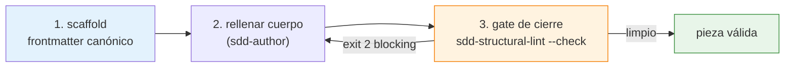

# Guía del contribuidor del ecosistema

Esta guía es el *cómo se hace* de modificar el propio SDD: crear skills, agentes y
overlays sin romper sus garantías. Complementa el [diseño técnico](../entender/tecnico.md)
(que explica el *por qué*) con las recetas concretas.

!!! warning "Antes de empezar: dónde editas"
    El ecosistema vive en `sdd/` (la SSoT del framework). Lo que un proyecto usa
    son **copias** en su `.claude/` y `.sdd/`, distribuidas por `install.sh`. Edita
    siempre la fuente en `sdd/`, nunca la copia instalada.

---

## El ciclo de creación

El rigor del meta-tooling no es prosa: es un bucle **scaffold → gate → auditoría**
donde cada eslabón es verificable.



## 1. Crear una skill o un agente

> *"Crea una skill nueva para…"* · *"Crea un agente que…"*

| Quiero crear… | Pido… |
|---|---|
| Una skill (kb-\* o wf-\*) | `/wf-skill-create` |
| Un agente especializado | `/wf-agent-create` |
| Un overlay de stack nuevo | `/wf-stack-create` |

Por debajo, **`sdd-scaffold.py`** genera el esqueleto con el frontmatter **canónico
por construcción** (layout por fase, nombre con prefijo correcto, color del agente,
`kb` sin `argument-hint`, `wf` con `context: fork`/`agent:`…) y un cuerpo con
`TODO`. El agente `sdd-author` luego **rellena el cuerpo**, sin tocar los campos
estructurales.

!!! info "Reparto de conocimiento al crear"
    Decidir **dónde** va lo que escribes es la decisión de diseño principal:

    - Conocimiento de enrutado (intención→workflow) → `CLAUDE.md` (eager).
    - Reglas de dominio (SSoT de una fase) → una `kb-*` (lazy, cargada por el
      agente que la declara en `skills:`).
    - Procedimiento (parsear, validar, delegar) → un `wf-*`.

    El detalle del contrato de capas está en [diseño técnico](../entender/tecnico.md).

## 2. El gate de cierre (no negociable)

Los 4 workflows de creación/refactor corren **`sdd-structural-lint.py --check`** al
cerrar. Caza lo mecanizable:

| Finding | Severidad | Qué detecta |
|---|---|---|
| `NAME-MISMATCH` | blocking | `name:` ≠ directorio |
| `REFERENCE-PATH-MISSING` | blocking | `${CLAUDE_SKILL_DIR}/references/...` que no resuelve |
| `CITED-RULE-MISSING` | blocking | Cita una `Regla N de kb-X` inexistente |
| `ABSOLUTE-PATH` | blocking | `/Users/`, `/home/` fuera de `docs/` |
| `ALLOWED-TOOLS-MISMATCH` | mixed | `Bash`/`Write`/`Agent` usados pero no declarados |
| `DESCRIPTION-TOO-LONG` | warning | `description` > 220 caracteres |

`exit 2` (blocking) **no permite declarar éxito**: hay que corregir. `exit 1`
(warnings) resume sin bloquear. Degrada con gracia si no hay python3.

:material-account-alert: **Edición a mano:** si editas un `SKILL.md` o un agente
directamente (cuando `sdd-author` no está disponible), el hook **PostToolUse**
`sdd-meta-lint-hook.py` te inyecta los findings blocking de ese archivo al instante
— el mismo gate, sin esperar al cierre.

## 3. Auditar el ecosistema

> *"Audita el ecosistema."*

**`/wf-sdd-audit`** corre el linter (`--json`) y delega los hallazgos al auditor.
**`/wf-sdd-refactor`** aplica cambios estructurales. Tras crear o borrar skills, el
**registry se regenera** (`generate-skill-registry.py`) como paso obligatorio — el
catálogo no puede mentir porque se escanea del filesystem.

---

## Crear un overlay de stack

> *"Crea el overlay para Flutter."*

**`/wf-stack-create`** genera un overlay que especializa Plan y Tasks. El mecanismo
es **sustitución por basename**: una pieza del overlay con el mismo nombre que una
genérica la reemplaza cuando `tech/<stack>/install.sh` corre **después** del base.

Los invariantes que tu overlay debe respetar (contrato completo en
`kb-sdd-stack-overlay-contract`):

1. **No romper el modo genérico** — quitarlo deja el pipeline funcional.
2. **Idempotencia** — reinstalar da el mismo resultado.
3. **Project state como precondición** — no caché.
4. **No tocar `prd/`, `spec/`, `design/`** — solo Plan y Tasks.
5. **Cierre verificable** — los agentes que tocan código cierran con build + tests
   reales (o declaran `tests: none` honestamente).
6. **El repo destino manda** sobre el dogma del stack.

!!! warning "No caves más hondo en stack único"
    Hoy el override por basename impide dos stacks en un repo (limitación
    transitoria, ROADMAP 6.1). Directiva: **ninguna pieza nueva debe profundizar la
    suposición de stack único** hasta que se implemente la resolución por ubicación.

---

## La suite de tests

Los scripts deterministas son el corazón del enforcement, así que están cubiertos
por una suite en **`sdd/tests/`** (stdlib `unittest`, black-box por subproceso sobre
fixtures en tmpdir, sin dependencias externas):

```bash
bash sdd/tests/run-tests.sh
```

Cubre los 13 scripts de estado/confianza, los installers (`install.sh`,
`tech/*/install.sh`, `setup.sh`) y el hook de sesión. Si tu cambio toca un script,
**añade o ajusta su test**: un script de enforcement sin test es una garantía sin
red.

### Conformidad (Casos de Uso)

Lo que la suite no puede automatizar (comportamiento de agente, flujos LLM) se
verifica a mano contra **`sdd/conformance/`** — el catálogo de **Casos de Uso**
(`CU-N.x`): para cada objetivo de usuario, qué debe hacer el sistema paso a paso. Es la
"Spec del SDD" y cumple el rol del playbook 11.6 (su `README.md` da el orden de
ejecución y el esquema de IDs).

Los casos se ejecutan sobre **proyectos reales** (no hay fixtures sintéticos): cada CU
abre con un bloque **"Proyecto a usar"** que dice qué tipo de proyecto buscar. El
`README.md` de conformance incluye el "kit mínimo" de proyectos que cubre el catálogo.

Si el ecosistema no se comporta como describe un escenario, abre una incidencia con la
plantilla *"Desviación de comportamiento"* citando el `CU-N.x`. Si cambias un
comportamiento, **actualiza su escenario `CU-N.x`**: un cambio sin su caso es incompleto.

---

## Restaurar el entorno de desarrollo

El `.claude/` de este repo es *gitignored* (workspace dev por symlinks). Si
`sdd-author` no resuelve como subagente —porque los symlinks dev se borraron—,
restáuralo:

```bash
bash setup.sh --dev
```

Esto también registra el hook PostToolUse de lint en el `settings.json` de
desarrollo. `setup.sh --uninstall` revierte todo preservando lo ajeno.

---

## Consulta rápida

| Quiero… | Pido… / Ejecuto… |
|---|---|
| Crear una skill | `/wf-skill-create` |
| Crear un agente | `/wf-agent-create` |
| Crear un overlay de stack | `/wf-stack-create` |
| Auditar la estructura del ecosistema | `/wf-sdd-audit` |
| Refactorizar piezas | `/wf-sdd-refactor` |
| Lintar a mano | `python3 sdd/scripts/sdd-structural-lint.py --check` |
| Correr los tests | `bash sdd/tests/run-tests.sh` |
| Restaurar `sdd-author` | `bash setup.sh --dev` |

!!! note "El criterio que gobierna todo"
    Si el fallo de una instrucción **corrompe estado o trazabilidad** → script
    determinista. Si solo **degrada calidad de texto** → prosa. No mecanices lo que
    exige juicio semántico: un script que adivina da falso rigor. Ese criterio, y
    el detalle de cada script, en [diseño técnico](../entender/tecnico.md) y
    [referencia de scripts](../referencia/scripts.md).
