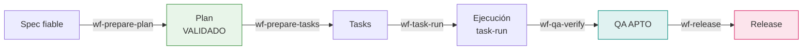
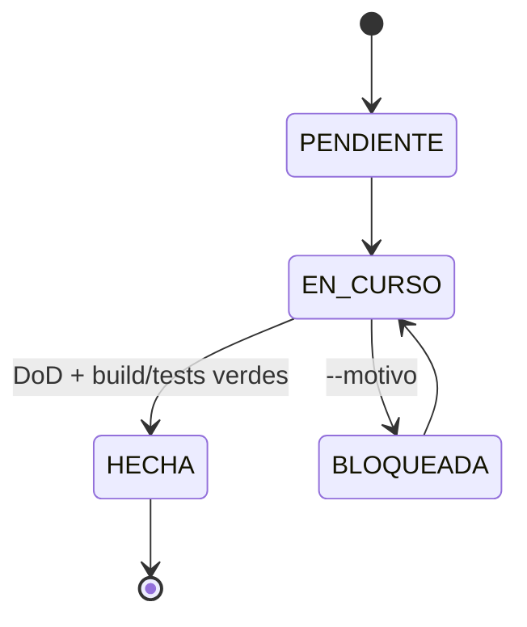

# Guía del desarrollador

Tu trabajo empieza cuando una feature ya tiene **spec fiable** y termina cuando
está **liberada con trazabilidad a un commit**. Esta guía es el recorrido de uso
diario: qué pides, en qué orden, y —lo más importante— **dónde el sistema se
detiene a esperarte**.

!!! info "Hablas, no tecleas comandos"
    Nunca escribes `/wf-prepare-plan` a mano. Describes lo que quieres en
    lenguaje natural y el orquestador elige el workflow y construye los
    argumentos. Los `/wf-*` de esta guía son para que entiendas **qué** se está
    invocando por debajo.

---

## Tu tramo del pipeline

---

## 1. Del spec al plan técnico

> *"Genera el plan de la feature de login."*

Invoca **`/wf-prepare-plan generate <feature_spec.md>`**, que delega en
`plan-architect`. El plan traduce el *qué* funcional del spec al *cómo* técnico,
fundamentado en la realidad del repositorio (no en abstracto).

**Precondiciones que el sistema verifica por ti:**

- El spec no tiene marcadores `[INCOMPLETO]` / `[CRÍTICO]` / `[INFERIDO]`.
- El spec está en sync con su PRD (`status_sync` fiable; la deriva se detecta por hash).
- Si la feature tiene UI, debe existir el handoff de Design — si no la tiene, Design se salta.

!!! warning "El gate es mecánico"
    Si el spec no es fiable, un hook `PreToolUse` **deniega** la ejecución con un
    motivo accionable. No es negociable pidiéndolo de otra forma: resuelve los
    marcadores primero (p. ej. con `/wf-spec-gap-resolve`).

## 2. Validar el plan (gate formal)

> *"Valida el plan."*

**`/wf-plan-validate <plan.md>`** audita el plan contra el spec y las reglas de
`kb-plan-expert`. **No es el mismo flujo que lo generó**: el sellado lo hace el
script `sdd-seal.py`, que verifica condiciones comprobables (todos los `CA-XXX`
del spec presentes, cero gaps abiertos, deuda técnica aprobada…). Solo entonces
el estado pasa a `VALIDADO`.

:material-account-alert: **Aquí decides tú:** si el plan declara **deuda técnica**
(`TD-00X`), el sistema te pide aprobar o rechazar cada una antes de sellar.

## 3. Generar las tasks

> *"Crea las tasks del plan."*

**`/wf-prepare-tasks generate <plan.md>`** (agente `task-generator`) descompone el
plan en tasks accionables `T-00X`, con dependencias, owner y trazabilidad al
`CA-XXX`. El gate exige que el plan siga `VALIDADO` (si se degradó a `BORRADOR`
tras una enmienda, se bloquea).

## 4. Ejecutar las tasks

> *"Implementa la siguiente task."* · *"Ejecuta todas las tasks."*

**`/wf-task-run <tasks.md> [--next | --task T-00X | --all]`** es el corazón de tu
día. Por defecto ejecuta **una task** (`--next`):

- Delega al **owner** de la task (agente del overlay de stack, o el orquestador en
  modo genérico).
- El estado es persistente (`PENDIENTE → EN_CURSO → HECHA | BLOQUEADA`), gestionado
  por `sdd-task-state.py` — **solo el script escribe el estado**.
- Verifica el **DoD** con evidencia y ejecuta build/tests reales; si no hay runner,
  lo registra explícitamente (honestidad, no maquillaje).
- Hace **un commit por task**: `T-00X: <título> [CA-XXX]`.

:material-account-alert: **Aquí decides tú:** si al implementar descubres que un
**CA es ambiguo**, no inventas la interpretación. El owner lo reporta y tú lanzas
**`/wf-spec-amend`** (aclaración quirúrgica, sin re-descender el waterfall). Si lo
que cambia es el *comportamiento esperado*, no es enmienda: es `/wf-spec-delta`.

## 5. Verificar QA

> *"Verifica la cobertura de QA de la feature."*

Con el plan de pruebas ya derivado (`/wf-qa-plan generate <spec.md>`, que puede
hacerse desde que el spec es fiable), **`/wf-qa-verify <qa_plan.md>`** ejecuta los
tests por cada `TC-XXX` y emite veredicto **APTO / APTO_CON_RESERVAS / NO_APTO**.

!!! danger "Un test que falla contra un CA es DIVERGENTE"
    Nunca se ajusta el test para que pase. Se abre **`/wf-bug`**. La regla de oro:
    *cobertura sin evidencia ejecutada no existe*.

## 6. Liberar

> *"Cierra la feature y etiquétala v1.2.0."*

**`/wf-release <feature_dir> [--tag <tag>]`** solo acepta features con QA
`APTO`/`APTO_CON_RESERVAS` (gate determinista). Captura el **commit SHA con git**
(no se teclea) y registra la coordenada en `<feature>_release.md`. Es el último
eslabón de la cadena `CA → TC → task → commit → release`.

---

## Mantenimiento: cuando algo ya entregado falla

> *"Hay un bug: el login no recuerda la sesión."*

**`/wf-bug <descripción> [--feature <nombre>]`** triajea **antes** de tocar código,
en tres categorías:

| Categoría | Qué significa | Qué hace |
|---|---|---|
| `CODE_BUG` | El código viola un CA | Fix delegado; el spec **no** se toca |
| `SPEC_CHANGE` | Lo esperado difiere del CA | No toca código; prepara `/wf-spec-delta` |
| `UNSPEC` | Ningún CA cubre el comportamiento | Formaliza primero (delta) o fix con aviso de gobernanza |

Registra cada caso como `B-00X` con trazabilidad al CA. No abandonas el pipeline
al primer sprint de mantenimiento: el bug entra por la misma puerta trazable.

---

## Consulta rápida

| Quiero… | Pido… |
|---|---|
| Ver en qué fase está cada feature y qué falta | *"¿Cómo va el proyecto?"* → `/wf-project-status` |
| Saber qué features están listas para implementar | *"¿Qué orden de implementación hay?"* → `/wf-spec-readiness` |
| Aclarar un CA ambiguo descubierto implementando | *"El CA-007 es ambiguo"* → `/wf-spec-amend` |
| Reportar un fallo de algo entregado | *"Hay un bug en…"* → `/wf-bug` |

!!! note "¿Por qué tantos gates?"
    Cada gate mecánico existe para que el sistema **no pueda mentir**: un plan no
    se sella sin cubrir los CAs, una task no se cierra sin build verde, una
    release no ocurre sin QA. Si quieres el porqué completo, lee
    [la visión funcional](../entender/funcional.md).
