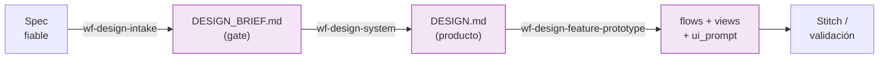

# Guía del diseñador

Tu trabajo empieza cuando una feature tiene **spec fiable** y produce el **contrato
visual** del producto y los artefactos por feature listos para Stitch (o
generadores web). No alteras el contrato funcional del spec: lo traduces a
presentación.

!!! info "La fase Design es saltable"
    Si una feature no tiene superficie de UI visible, Spec pasa directo a Plan.
    Design solo entra cuando hay algo que ver y navegar.

---

## Tu tramo del pipeline



---

## 1. Cerrar el brief (gate obligatorio)

> *"Cierra el brief de diseño de esta feature."*

**`/wf-design-intake generate <feature_spec.md>`** (agente `design-architect`)
cierra el `DESIGN_BRIEF.md`: modo de decisión, preset de producto, familia visual,
densidad, profundidad, motion y política de autonomía frente a la IA. Es el **gate
obligatorio**: no se genera el sistema visual sin brief cerrado.

Modos: `--mode guided` (te acompaña con un árbol de decisión, ideal si no tienes
claro el estilo), `hybrid` o `auto`.

!!! tip "Antes del brief, si quieres material"
    - **`/wf-design-moodboard`** captura *vibes* (paletas, atmósfera, texturas) que
      alimentan el intake con material concreto.
    - **`/wf-design-discover`** hace research de 3-5 apps reales del mercado como
      referencias, validadas por ti.

## 2. Generar el sistema visual

> *"Crea el DESIGN.md."*

**`/wf-design-system generate <feature_spec.md> --brief DESIGN_BRIEF.md`** produce
el `DESIGN.md`: la identidad visual **persistente del producto** (color modes,
type scale, iconografía, motion, voice, reference apps) que alimentará el generador
de UI y todos los prototipos de features.

## 3. Prototipar por feature

> *"Genera las vistas para Stitch."*

**`/wf-design-feature-prototype generate <feature_spec.md> --brief DESIGN_BRIEF.md`**
deriva tres artefactos por feature:

| Artefacto | Es la SSoT de… |
|---|---|
| `_flows.md` | Secuencias, navegación y transiciones |
| `_views.md` | Pantallas y **todos** sus estados (default, loading, empty, error, success) |
| `_ui_prompt.md` | Ensamblaje *tool-agnostic* para Stitch (mobile) o web-generic |

Cada vista traza a los journeys y CAs del spec, con microcopy mínimo. Listos para
contrastar con cliente antes del plan técnico.

---

## Onramp brownfield: UI que ya existe

> *"Documenta el sistema visual que ya tenemos."*

Si la UI **ya está en producción** y no se va a rediseñar, no partes de cero:
**`/wf-design-extract`** hace ingeniería inversa del `DESIGN.md` desde CSS, tokens,
componentes y capturas — cada decisión visual con su evidencia (`archivo:línea`,
mediciones). Es el espejo de `wf-spec-from-code` en Design: **no exige spec ni
brief**, es entrada alternativa a la fase.

```
discover <path_ui>   → mapa de evidencia visual → SE DETIENE en gate humano
generate <path_ui>   → DESIGN.md con origin: extracted
```

:material-account-alert: **Aquí decides tú:** `discover` siempre se detiene para
que confirmes o descartes la evidencia antes de generar. Las inconsistencias reales
de la UI se **documentan** (`[INCONSISTENTE]`), no se promedian — unificarlas es
rediseño, no extracción.

---

## Evolución, auditoría y exportación

Un `DESIGN.md` vive y cambia. El kit de mantenimiento:

| Quiero… | Pido… |
|---|---|
| Auditar un DESIGN.md sin regenerarlo | `/wf-design-validate <DESIGN.md>` |
| Auditar accesibilidad (contraste, targets, focus) | `/wf-design-a11y-audit <DESIGN.md> [--target AA\|AAA]` |
| Evolucionar el sistema incrementalmente | `/wf-design-delta analyze <DESIGN.md> --new-reqs <cambios.md>` → `apply` |
| Saber qué quedó stale tras un cambio | `/wf-design-sync <DESIGN.md>` |
| Exportar tokens a código (CSS, Compose, SwiftUI, Tailwind…) | `/wf-design-export <DESIGN.md> --platforms ...` |

### Exploración y A/B

| Quiero… | Pido… |
|---|---|
| Probar una variante paralela del sistema sin comprometer main | `/wf-design-branch create <nombre>` |
| A/B testing visual de una feature | `/wf-design-variant create <feature_spec.md> --variants A,B` |
| Incorporar feedback no estructurado de stakeholders | `/wf-design-feedback capture <feedback>` → `triage` |

---

!!! note "Fit declarado de la fase Design"
    Pensada para equipos sin diseñador, greenfield y Stitch; **no** cubre Figma. El
    detalle y los principios estructurales (separación design↔spec, niveles
    producto vs feature, orden de derivación) están en `design/CLAUDE.md` y en
    [la visión funcional](../entender/funcional.md).
