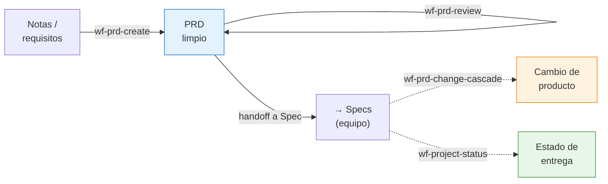
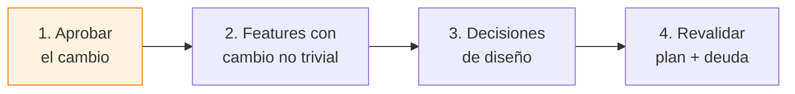

# Guía de producto / PM

Tu territorio es el **origen** del pipeline (el PRD) y su **gobernanza** (los
cambios de producto), más la **visión de entrega** (qué hay en cada fase). No
escribes specs ni planes: defines el negocio y decides el alcance; el sistema
deriva el resto y te avisa de lo que necesita tu decisión.

!!! info "Hablas, no tecleas comandos"
    Describes lo que quieres en lenguaje natural; el orquestador elige el workflow
    y construye los argumentos. Los `/wf-*` de esta guía son para que entiendas qué
    se invoca por debajo.

---

## Tu tramo del pipeline

---

## 1. Redactar el PRD

> *"Crea un PRD a partir de estas notas."*

**`/wf-prd-create <directorio> [--source <notas.md>]`** (agente `prd-expert`)
redacta el documento de negocio: problema, actores, alcance dentro/fuera, reglas.
Un PRD válido **no contiene tecnología** — eso es decisión del Plan, no tuya.

!!! danger "Red anti-fabricación"
    Sin `--source`, el riesgo de que el sistema *invente* actores o alcance desde
    un brief pobre es real. La regla: toda afirmación de negocio **traza a tu
    material fuente**, o se marca `[ASUNCIÓN]` con un `[ASN-XXX]` recopilado. No se
    inventa en silencio.

## 2. Revisar y limpiar (recomendado)

> *"Revisa este PRD."*

**`/wf-prd-review <prd.md>`** valida que el PRD está bien planteado y limpio de
contaminación técnica.

:material-account-alert: **Aquí decides tú:** el review tiene un **gate de
confirmación humana** de asunciones. Te presenta cada `[ASN-XXX]` (confirmar /
rechazar / editar) y solo edita el PRD según tu decisión. **Un PRD con asunciones
sin confirmar no queda `LISTO`.**

## 3. Handoff al equipo (Spec)

El paso obligatorio que conecta tu PRD con el resto del pipeline es
**`/wf-spec-analyze`** (lo lanza el equipo o tú). Detecta gaps antes de generar
specs.

:material-account-alert: **Aquí decides tú:** si el analysis deja gaps
`[CRÍTICO]`, hay que responderlos antes de continuar (o aceptar avanzar con un
override explícito). Y si tus respuestas **expanden la capacidad** del producto
(una entidad nueva, un catálogo, un flujo no comprometido), el sistema **no
continúa**: te pide formalizarlo primero como cambio de producto. Es intencional —
evita que el alcance crezca por la puerta de atrás.

A partir de aquí el equipo descubre features (`wf-spec-discover`) y genera specs.
Tú decides **qué features entran en cada iteración** sobre el mapa de discovery.

---

## Cambios de producto

El producto cambia: scope, prioridad, exclusiones. **Nunca** se edita el PRD a
mano y ya está —eso rompe la sincronización con todo lo derivado en silencio. El
cambio entra por la puerta de gobernanza.

> *"El cliente quiere añadir pago con tarjeta al checkout."*

| Quiero… | Pido… | Qué hace |
|---|---|---|
| Formalizar el cambio | `/wf-prd-change <prd.md> --new-reqs <cambio.md>` | Materializa el cambio en el PRD con tu aprobación |
| Medir el impacto | `/wf-prd-sync-impact <prd.md>` | Qué artefactos derivados quedaron stale |
| Resincronizar specs | `/wf-spec-sync-from-prd apply <prd.md> --features ...` | Propaga el cambio a las specs afectadas |

### El atajo: propagar todo en un comando

> *"Propaga este cambio por todo el pipeline."*

**`/wf-prd-change-cascade <prd.md> --new-reqs <cambio.md>`** encadena toda la
cascada y se detiene **solo en los 4 checkpoints humanos reales**:

Auto-aplica los deltas de spec inequívocos (`minor`); lista sin aplicar los que
necesitan tu criterio (`major`). Flags útiles: `--review-before-apply` (parada
conservadora antes de cualquier escritura), `--dry-run` (solo diagnostica),
`--features F-001,...` (acota), `--skip-design`.

---

## Ver el estado de entrega

> *"¿Cómo va el proyecto?"*

**`/wf-project-status`** es un informe **read-only**: por feature te dice la fase
alcanzada, el estado de esa fase (spec, plan `BORRADOR`/`VALIDADO`, tasks
`X/total`, QA `APTO`/`NO_APTO`, release), el bloqueo y la **siguiente acción
concreta**. No razona ni edita: agrega el estado ya sellado por los scripts, así
que lo que ves es la verdad mecánica, no una opinión.

---

## Consulta rápida

| Quiero… | Pido… |
|---|---|
| Redactar un PRD desde notas | *"Crea el PRD de…"* → `/wf-prd-create` |
| Revisar un PRD | *"Revisa el PRD"* → `/wf-prd-review` |
| Formalizar un cambio | *"Añade … al producto"* → `/wf-prd-change` |
| Propagar el cambio entero | *"Propaga el cambio por el pipeline"* → `/wf-prd-change-cascade` |
| Ver en qué punto está cada feature | *"¿Cómo va el proyecto?"* → `/wf-project-status` |

!!! note "¿Por qué tanto control sobre el cambio?"
    Cada artefacto derivado (spec, design, plan, tasks) traza a tu PRD. Un cambio
    sin gobernanza convierte toda esa trazabilidad en mentira documental. El porqué
    completo está en [la visión funcional](../entender/funcional.md).
