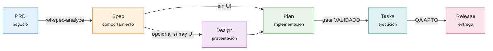
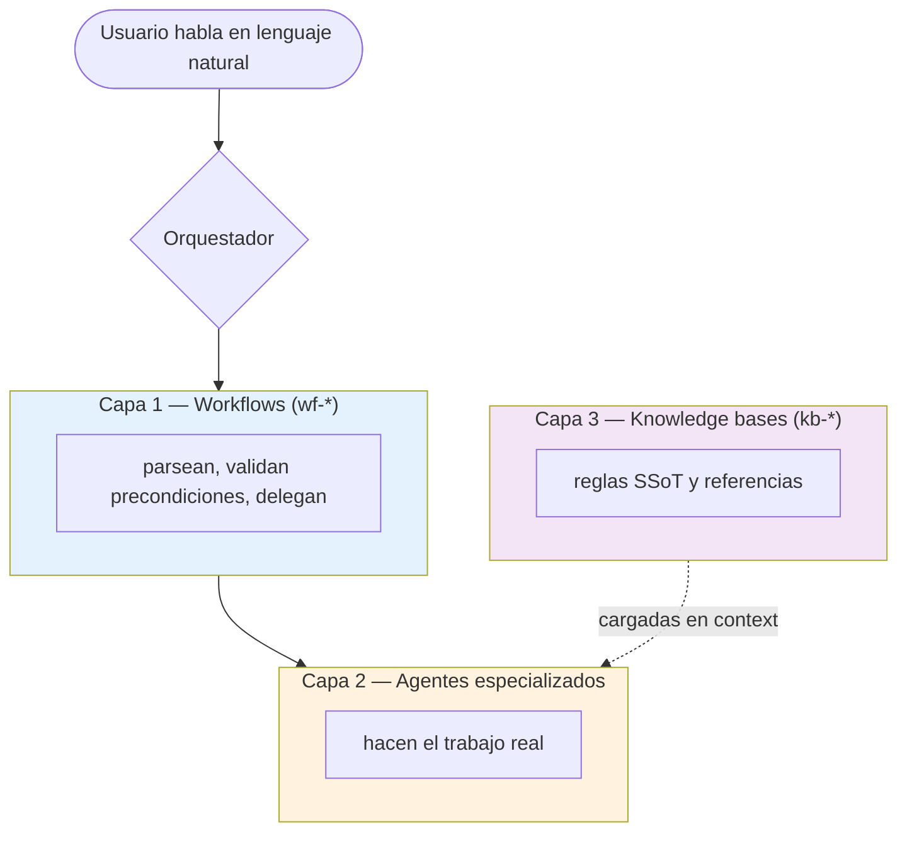

# SDD Lab

Un ecosistema de **agentes de Claude Code** que cubre el pipeline completo de
**Spec-Driven Development**: desde un PRD informal hasta tasks implementadas,
verificadas y liberadas — con trazabilidad de punta a punta y *anti-alucinación*
verificada por scripts deterministas, no por la buena fe del modelo.

!!! tip "¿Primera vez aquí?"
    Si solo quieres ver el sistema en marcha, salta a
    **[Tu primera feature](empezar/primera-feature.md)**. Si vas a trabajar a
    diario con él, busca tu perfil más abajo.

---

## El mapa en una imagen

Cada flecha es un **gate**: no se pasa de fase sin cumplir su precondición, y los
gates críticos los verifica un script, no el agente que generó el artefacto
(*autor ≠ verificador*).

---

## ¿Quién eres?

-   :material-laptop: **Desarrollador**

    ---

    Llevas features de spec a código: plan, tasks, ejecución, QA, bugs y release.

    [→ Guía del desarrollador](guias/desarrollador.md)

-   :material-clipboard-text: **Producto / PM**

    ---

    Arrancas PRDs, formalizas cambios de producto y consultas el estado de entrega.

    [→ Guía de producto](guias/producto.md)

-   :material-palette: **Diseñador**

    ---

    Cierras el brief visual, generas el sistema de diseño y los prototipos por feature.

    [→ Guía del diseñador](guias/disenador.md)

-   :material-wrench: **Contribuidor del ecosistema**

    ---

    Creas o modificas skills, agentes y overlays de stack del propio SDD.

    [→ Guía del contribuidor](guias/contribuidor.md)

---

## Entender por qué funciona así

Si vas a tocar el sistema —o solo quieres entender las decisiones de diseño— hay
dos lecturas complementarias:

- **[Visión funcional](entender/funcional.md)** — la filosofía (spec-driven,
  anti-alucinación, autor≠sellador), qué hace cada fase, los caminos reales
  (greenfield, brownfield, iteración, cambio de producto) y **dónde decide el humano**.
- **[Diseño técnico (IA)](entender/tecnico.md)** — por qué cada conocimiento vive
  donde vive (CLAUDE.md vs rule vs kb vs wf vs agente), la mecánica de carga, la
  resolución de paths, la arquitectura de enforcement y las trampas conocidas.

---

## Las tres capas del ecosistema

La misma estructura se repite en PRD, Spec, Design, Plan y Tasks. El detalle de
qué piezas participan en cada fase está en la
[referencia](referencia/skills.md) y en los `DIAGRAMS.md` de cada fase.
