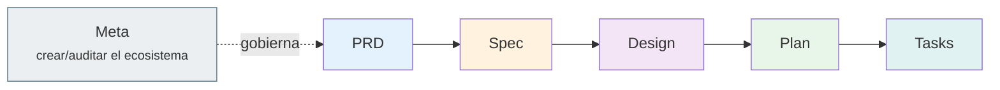

# Catálogo de skills

El ecosistema son **131 skills** (56 workflows `wf-*` user-invocable + 75 knowledge
bases `kb-*`) más 9 agentes, organizados por fase. Esta página explica cómo está
estructurado el catálogo y dónde encontrar la pieza que buscas; **no reproduce la
lista** (eso es SSoT generada, ver más abajo).

---

## Cómo leer el catálogo

Tres tipos de pieza, por su prefijo:

| Prefijo | Tipo | Invocable | Rol |
|---|---|---|---|
| `wf-*` | Workflow | ✅ sí | Procedimiento: parsea, valida precondiciones, delega |
| `kb-*` | Knowledge base | ❌ no | Reglas SSoT y referencias, cargadas por un agente |
| *(sin prefijo)* | Agente | (vía delegación) | El worker que ejecuta con sus `kb-*` inyectadas |

!!! tip "No invocas comandos: hablas"
    No necesitas saber el nombre de la skill. Describes la intención en lenguaje
    natural y el orquestador la mapea. Los `wf-*` son el *cómo* interno.

---

## Organización por fase

| Fase | Workflows clave | Agentes |
|---|---|---|
| **Meta** | `wf-skill-create`, `wf-agent-create`, `wf-stack-create`, `wf-sdd-audit`, `wf-sdd-refactor`, `wf-project-init`, `wf-sdd-update` | — |
| **PRD** | `wf-prd-create`, `wf-prd-review`, `wf-prd-change`, `wf-prd-change-cascade`, `wf-prd-sync-impact` | `prd-expert` |
| **Spec** | `wf-spec-analyze`, `wf-spec-features-first`, `wf-spec-fast-track`, `wf-spec-from-code`, `wf-spec-validate`, `wf-spec-conflict`, `wf-spec-readiness`, `wf-spec-delta`, `wf-spec-amend` | `sdd-spec-explorer`, `sdd-spec-planner`, `sdd-spec-writer`, `sdd-spec-auditor` |
| **Design** | `wf-design-intake`, `wf-design-system`, `wf-design-feature-prototype`, `wf-design-extract`, `wf-design-validate`, `wf-design-a11y-audit`, `wf-design-delta`, `wf-design-sync`, `wf-design-export` | `design-system-architect`, `design-feature-architect` |
| **Plan** | `wf-prepare-plan`, `wf-plan-validate` | `plan-architect`, `plan-auditor` |
| **Tasks** | `wf-prepare-tasks`, `wf-task-run`, `wf-qa-plan`, `wf-qa-verify`, `wf-bug`, `wf-release`, `wf-project-status` | `task-generator`, `qa-engineer` |

---

## Las fuentes de verdad

El catálogo no se mantiene a mano (driftaría). Sus SSoT:

- **El rootmap** (`CLAUDE.md` raíz y por fase) — la tabla canónica
  *intención del usuario → skill → argumentos*. Es lo que consulta el orquestador.
- **`meta/skill-registry.md`** — el catálogo completo de las 131 skills con
  description y path, **auto-generado** por `generate-skill-registry.py` escaneando
  el filesystem. Cualquiera de los workflows de creación lo regenera al cerrar.

!!! note "Por qué no listamos las 131 aquí"
    Reproducir el registry en esta página crearía una segunda copia que se
    desincroniza al primer cambio. El registry generado es la única lista
    autoritativa; esta página da el mapa para navegarlo.
