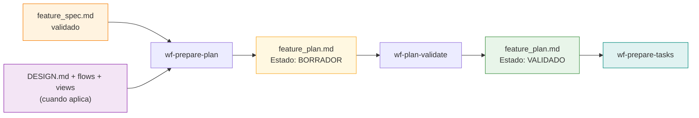
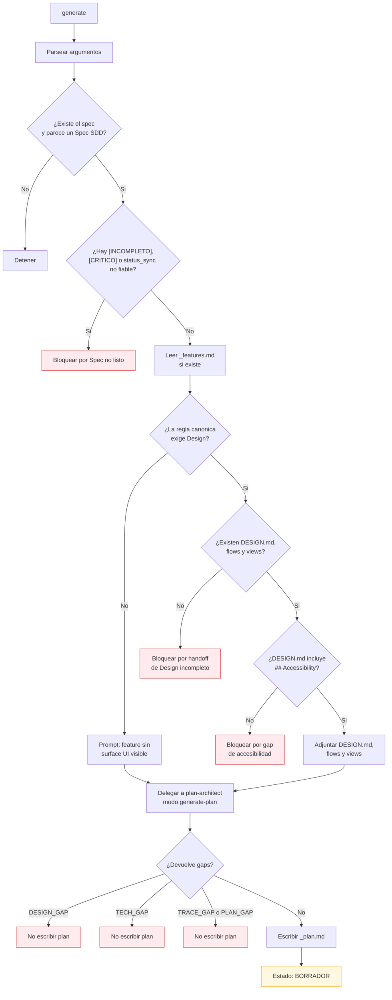
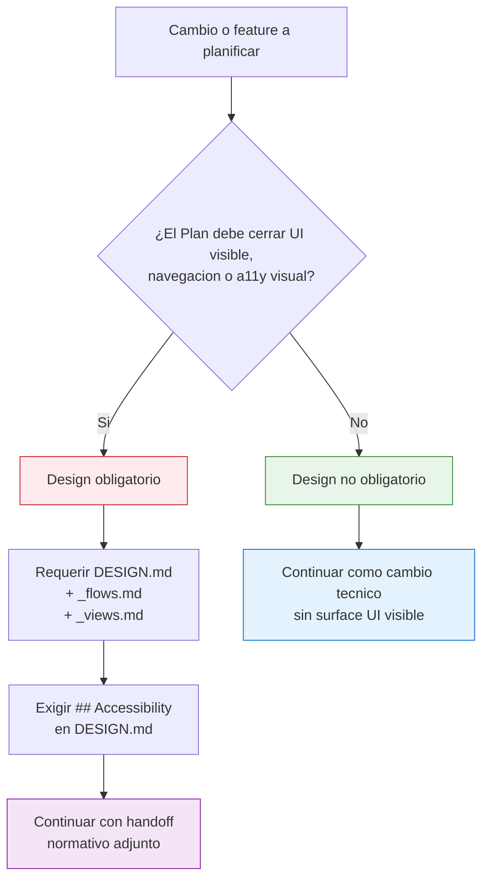
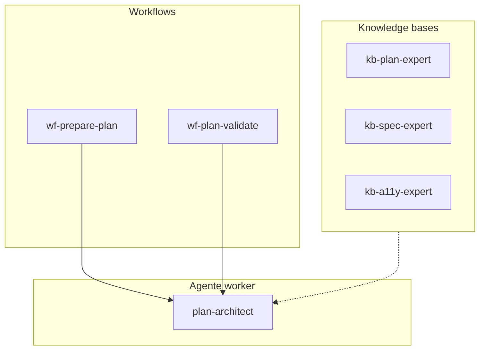
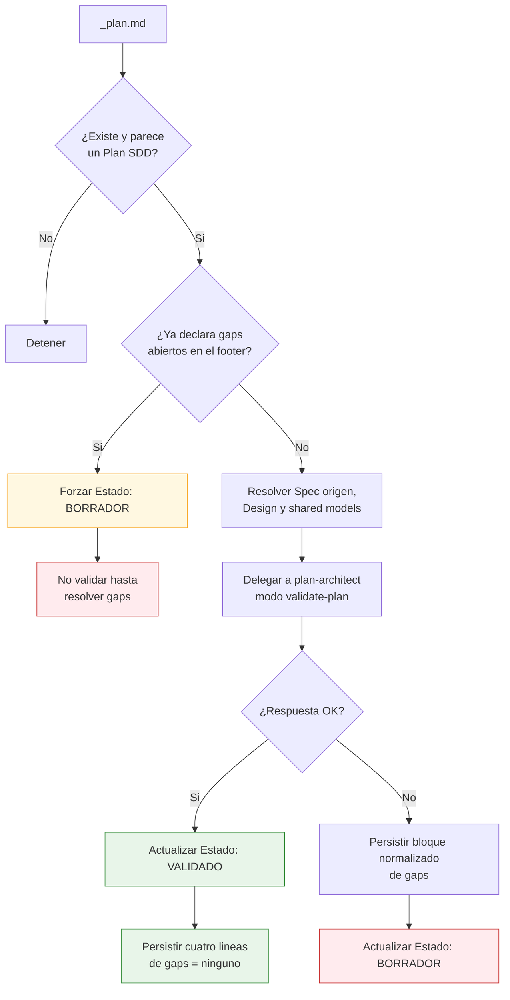
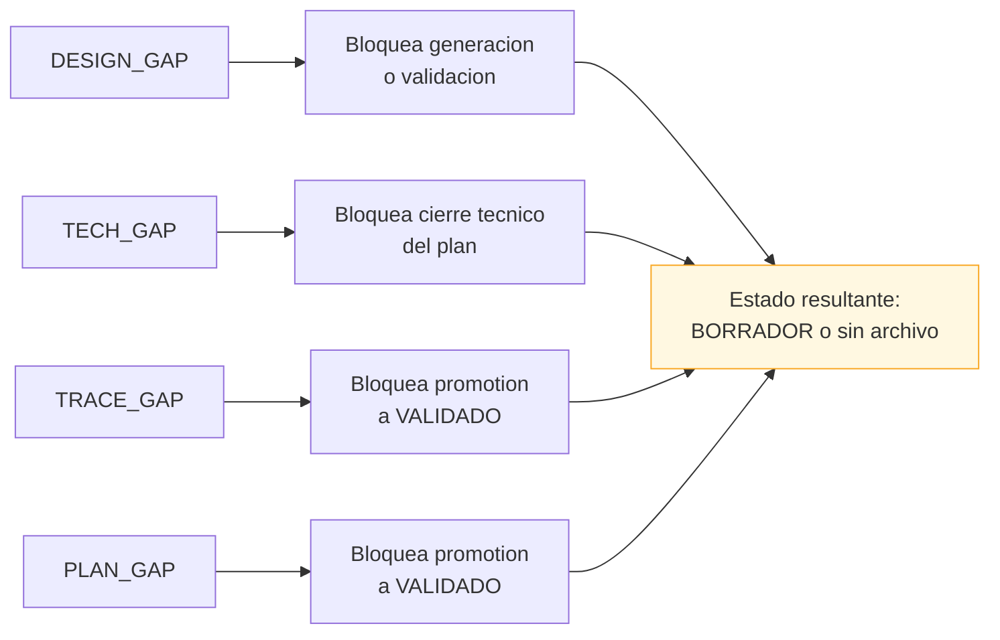

# SDD Plan — Diagramas de la fase de cierre técnico

Este documento contiene los diagramas detallados de la fase `plan`: generación del `_plan.md`, resolución del handoff de Design, auditoría formal y promoción a `VALIDADO`.

Para la vista global del sistema, usa [sdd/DIAGRAMS.md](../DIAGRAMS.md).

---

## 1. Posición de Plan en el pipeline

**Pregunta que responde:** ¿qué resuelve `plan` entre `design` y `tasks`?

**Mensaje clave:** `plan` no trocea trabajo; cierra decisiones arquitectónicas y deja un `_plan.md` primero en `BORRADOR` y solo luego en `VALIDADO`.

---

## 2. Flujo interno de `wf-prepare-plan`

**Pregunta que responde:** ¿qué validaciones y bifurcaciones existen antes de escribir el `_plan.md`?

**Mensaje clave:** `wf-prepare-plan` no genera nada si el Spec no está listo o si falta handoff normativo de Design cuando la feature lo necesita.

---

## 3. Regla de decisión: cuándo Design es obligatorio

**Pregunta que responde:** ¿en qué casos `plan` debe bloquearse esperando handoff visual?

**Mensaje clave:** la obligación de Design depende del tipo de verdad que el Plan debe cerrar, no de una preferencia del agente ni de si “sería útil” tener mocks.

---

## 4. Arquitectura interna de la fase Plan

**Pregunta que responde:** ¿cómo se reparten responsabilidades entre workflows, agente y knowledge base?

**Mensaje clave:** los workflows no diseñan ni auditan por sí mismos; reúnen contexto, aplican gates y delegan el trabajo técnico real a `plan-architect`.

---

## 5. Flujo interno de `wf-plan-validate`

**Pregunta que responde:** ¿cómo se sella un `_plan.md` como `VALIDADO` o se devuelve a `BORRADOR`?

**Mensaje clave:** la validación no reescribe arquitectura; solo certifica si el plan puede pasar a `tasks` y persiste su estado operativo.

---

## 6. Taxonomía de gaps y efecto operativo

**Pregunta que responde:** ¿qué tipos de gaps existen y qué bloquean exactamente?

**Mensaje clave:** la fase `plan` usa solo cuatro tipos normativos de gap; cualquier hallazgo debe caer en una de esas categorías para mantener el gate estable.
