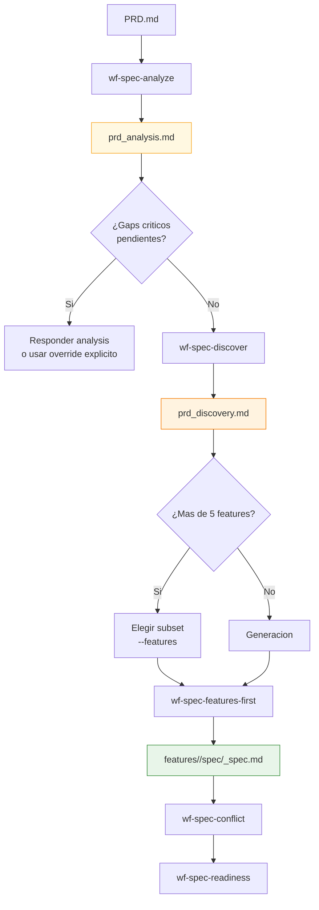
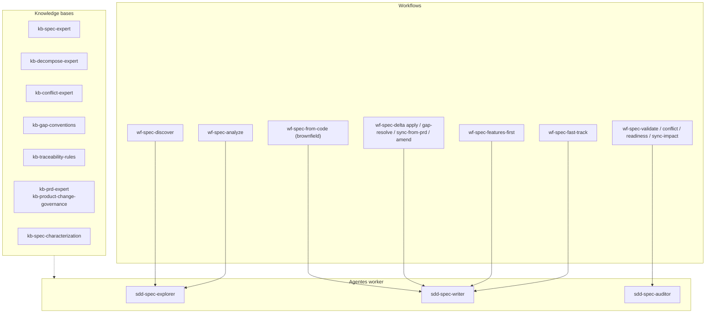
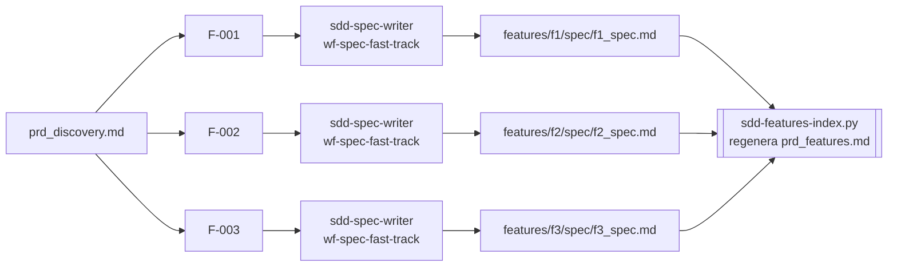
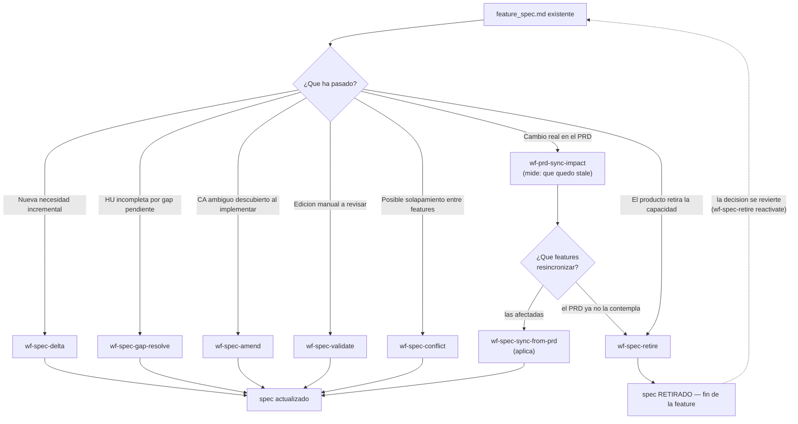

# SDD Spec — Diagramas de Specify y Decompose

Este documento contiene los diagramas detallados de la fase `spec`: análisis, discovery, generación por feature, evolución y validación.

Para la vista global del sistema, usa [sdd/DIAGRAMS.md](../DIAGRAMS.md).

---

## 1. Flujo features-first completo

**Pregunta que responde:** ¿qué pasos internos sigue la generación de specs por feature?

**Mensaje clave:** `wf-spec-features-first` no es un generador ciego; está protegido por analysis, guardrails de scope y control de coste.

---

## 2. Arquitectura interna de la fase Spec

**Pregunta que responde:** ¿cómo se reparten responsabilidades entre workflows, agentes y knowledge bases?

**Mensaje clave:** en `spec`, la separacion entre explorar, escribir y auditar es parte del diseño, no accidental.

---

## 3. Fast-track paralelo por feature

**Pregunta que responde:** ¿qué hace exactamente el tramo paralelo del workflow features-first?

**Mensaje clave:** el paralelismo vive en la generacion por feature; `_features.md` no se escribe a mano ni se consolida con prosa — es un **indice generado** por `sdd-features-index.py` a partir del discovery + los specs en disco + el readiness report. Un conflicto de merge sobre el hub es ruido: se regenera tras el merge.

---

## 4. Mantenimiento de specs existentes

**Pregunta que responde:** ¿qué rutas existen cuando el spec ya esta creado?

**Mensaje clave:** no todo cambio se resuelve regenerando desde cero; `spec` tiene caminos quirurgicos para evolucion, sync y cierre. **Seis llevan al spec actualizado y una no**: la baja es la unica salida terminal, y el ID de la feature se conserva sin reutilizarse.

**Tres aristas que el diagrama tiene implicitas y conviene no saltarse:**

- **Medir antes de aplicar.** Un cambio de PRD no entra directo en `wf-spec-sync-from-prd`: primero `wf-prd-sync-impact` dice **que** quedo `stale` o `needs_review`, y revisar ese informe es un checkpoint humano bloqueante. Es tambien donde se separan las dos salidas: una feature afectada se resincroniza, una que el PRD ya no contempla se da de baja — y esa segunda no se decide en un fork.
- **La baja cierra tambien la puerta que este diagrama no dibuja ([[D-080]]).** Aqui solo entran las
  vias que arrancan **desde un spec existente**. Las que lo **regeneran** arrancan desde el PRD o
  desde el codigo —fast-track, caracterizacion, generacion por feature— y aterrizan en el mismo
  fichero: tambien paran ante un `RETIRADO`, lo dicen y no lo pisan. Y un spec retirado queda fuera
  del analisis de conflictos: un choque contra algo que no se va a implementar no es un conflicto.
- **La reactivacion es la unica vuelta atras, y no restaura sellos.** Devuelve el spec a `BORRADOR`, no a `VALIDADO`; el plan sigue en `BORRADOR` desde la baja. Ningun otro camino sale de `RETIRADO`: desde [[D-078]], tampoco el `--unseal` con el que cierran delta, amend y gap-resolve.
