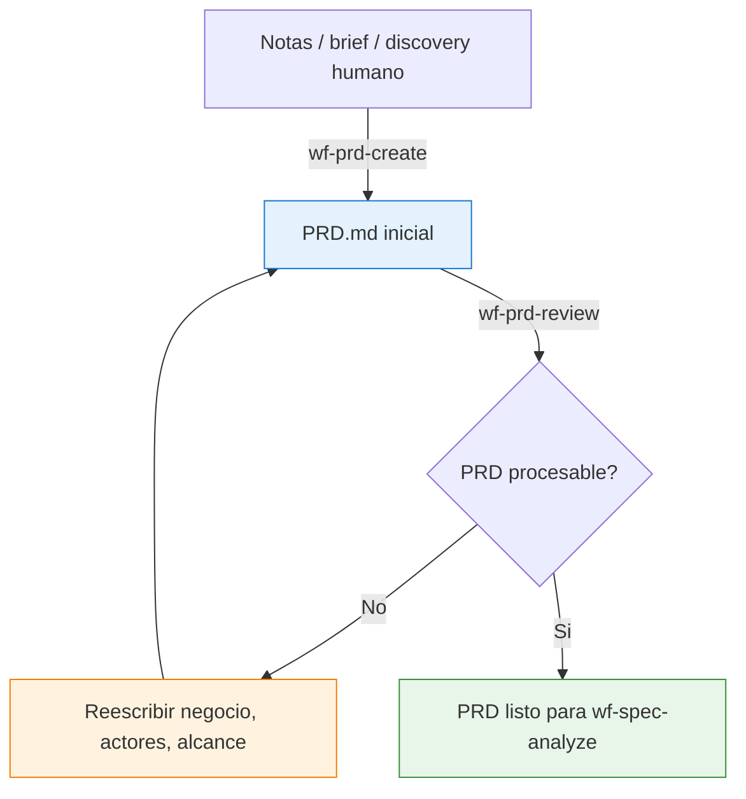
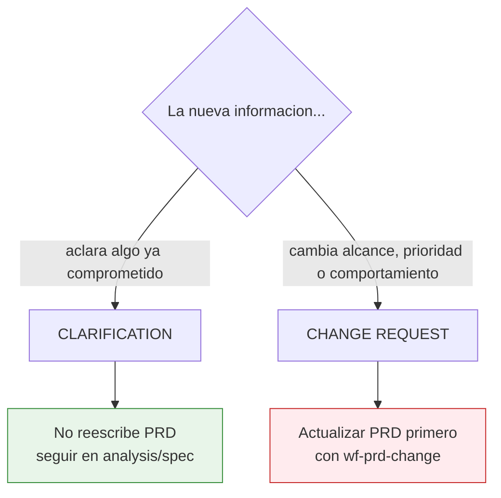
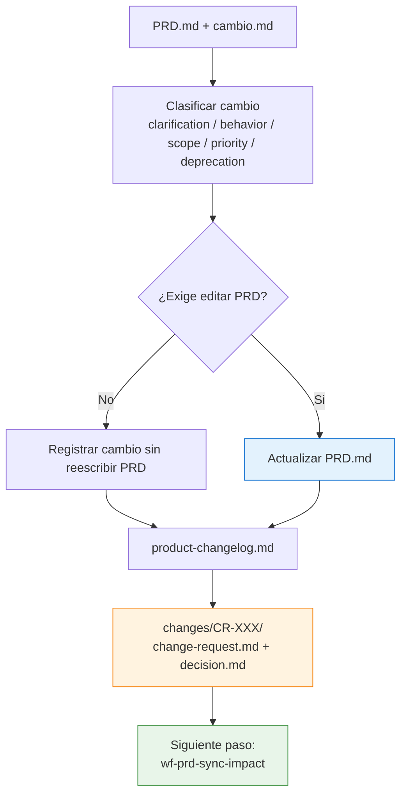
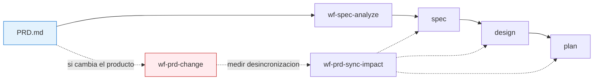

# SDD PRD — Diagramas de la fase de entrada

Este documento contiene los diagramas detallados de la fase `prd`: entrada de requisitos, preflight y gobernanza de cambios de producto.

Para la vista global del sistema, usa [sdd/DIAGRAMS.md](/Users/oscar/Documents/GitHub/ai-dev-agents-lab/sdd/DIAGRAMS.md).

---

## 1. Entrada PRD antes de entrar en Spec

**Pregunta que responde:** ¿qué ocurre desde un brief informal hasta tener un PRD listo para `spec`?

**Mensaje clave:** `wf-prd-review` no crea specs; solo evita que entre a `spec` un PRD contaminado o mal planteado.

---

## 2. Gobernanza: aclaracion vs cambio de producto

**Pregunta que responde:** cuando aparece nueva informacion, ¿basta con resolver un gap o hay que abrir un change request?

**Mensaje clave:** si cambia el producto comprometido, el PRD se actualiza antes de tocar derivados.

---

## 3. Flujo interno de `wf-prd-change`

**Pregunta que responde:** ¿qué artefactos produce y qué paso viene después de un cambio de producto?

**Mensaje clave:** `wf-prd-change` no termina en el PRD; deja trazabilidad y prepara la resincronizacion aguas abajo.

---

## 4. Posicion de PRD dentro del pipeline

**Pregunta que responde:** ¿cómo se conecta `prd` con el resto del sistema?

**Mensaje clave:** PRD es fuente de verdad de negocio incluso despues de haber generado specs.
