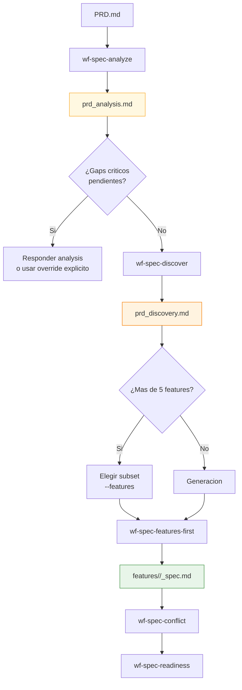
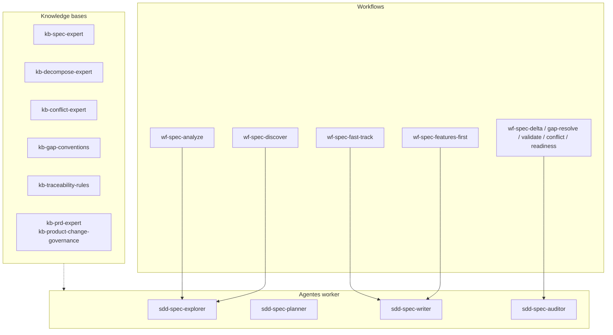
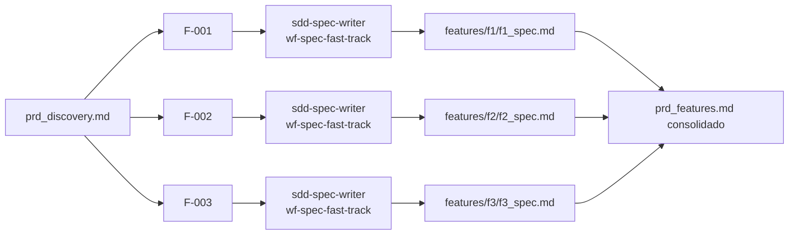
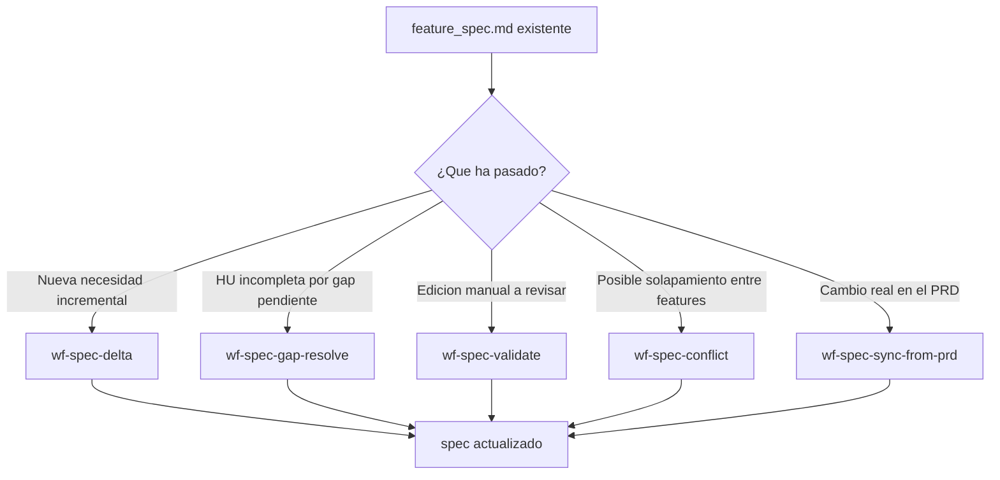

# SDD Spec — Diagramas de Specify y Decompose

Este documento contiene los diagramas detallados de la fase `spec`: análisis, discovery, generación por feature, evolución y validación.

Para la vista global del sistema, usa [sdd/DIAGRAMS.md](/Users/oscar/Documents/GitHub/ai-dev-agents-lab/sdd/DIAGRAMS.md).

---

## 1. Flujo features-first completo

**Pregunta que responde:** ¿qué pasos internos sigue la generación de specs por feature?

**Mensaje clave:** `wf-spec-features-first` no es un generador ciego; está protegido por analysis, guardrails de scope y control de coste.

---

## 2. Arquitectura interna de la fase Spec

**Pregunta que responde:** ¿cómo se reparten responsabilidades entre workflows, agentes y knowledge bases?

**Mensaje clave:** en `spec`, la separacion entre explorar, escribir y auditar es parte del diseño, no accidental.

---

## 3. Fast-track paralelo por feature

**Pregunta que responde:** ¿qué hace exactamente el tramo paralelo del workflow features-first?

**Mensaje clave:** el paralelismo vive en la generacion por feature; la consolidacion de `_features.md` vuelve a ser centralizada.

---

## 4. Mantenimiento de specs existentes

**Pregunta que responde:** ¿qué rutas existen cuando el spec ya esta creado?

**Mensaje clave:** no todo cambio se resuelve regenerando desde cero; `spec` tiene caminos quirurgicos para evolucion y sync.
